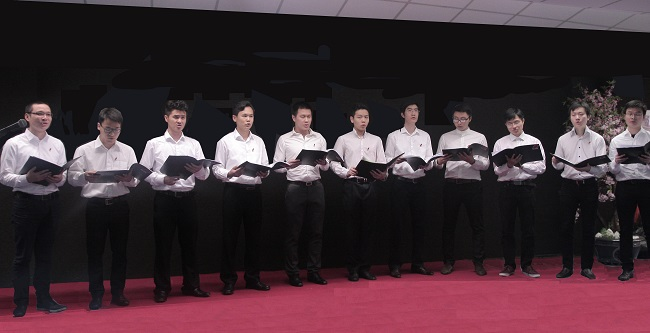
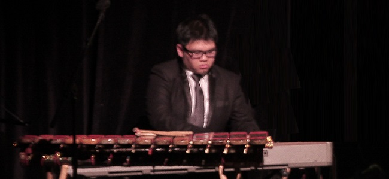
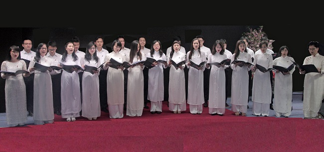

<!--
title: Hợp Ca Quê Hương tham gia gây quỹ ủng hộ làng trẻ em mồ côi Thủy Xuân ở Huế
author: Tich Ky
-->

Ngày 05/4/2014 tại trung tâm văn hóa văn hóa Việt Nam tại Pháp.

Hợp Ca Quê Hương đã tham gia vào chương trình nghệ thuật nhằm gây quỹ ủng hộ làng trẻ em mồ côi Thủy Xuân ở Huế. 

Tốp ca Nam trình bày Giai điệu Tổ quốc . Đậu xuân tuấn lĩnh xướng Duy Tâm piano

Hợp Ca Quê Hương trình bày Acapela Trống cơm. Hợp xướng bốn bè  soạn giả: Bình Trang
 
 