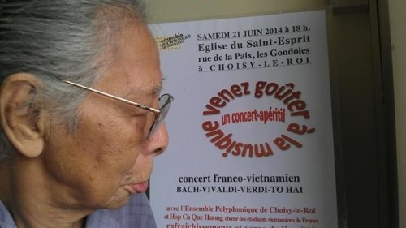
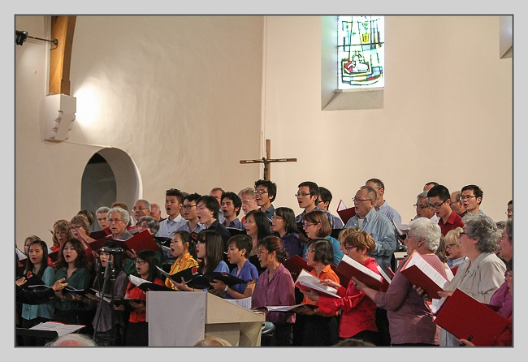

<!--
title: Ensemble Polyphonique de Choisy-le-Roi và Hợp Ca Quê Hương tai Fête de la musique 2014
author: Nguyễn Tích Kỳ
status: completed
-->

  
**Lễ hội Fête de la musique**

Ngày thứ bảy 21/6 /2014 vào lúc 15g30 Hợp Ca Quê Hương trình diễn tại Choisy le Roi cùng với Ensemble Polyphonique de Choisy-le-Roi.

Nhân ngày Fête de la Musique, nhằm duyệt chương trình cho buổi trình diễn sắp tới tại Thị sảnh quận 13. Đặc điểm của hôm nay sẽ có 2 Nhạc trưởng Ông Laurent Boer sẽ điều khiển Nabucco, và Bà Ngân Hà sẽ đều khiển Tiếng hát người chiến sỹ biên thùy. 
                                                                   
Cũng là một dịp để nhắc lại sự gắn bó của Choisy đối với Việt Nam nhân dịp năm hữu nghị Phap/Việt 2014. Choisy-le-Roi là một Thị Trấn đã kết nghĩa với quận Đống Đa của thời hoa lửa. 

**Cập nhật:  từ  hoinhacsi.org**

  
*Nhạc sĩ Tô Hải chup bên cạnh aphích ngày trình diễn*

Hưởng ứng Năm Việt / Pháp ngày 21-6-2014, một chương trình đồng ca bằng tiếng việt với sự tham gia của Ensemble Polyphonique de Choisy-le-Roi và Hợp ca Quê hương. Cùng một chương trình có các tác phẩm của : Bach, Vivaldi, Verdi và Tô Hải. Chương trình với sự tham gia cố vấn của nhạc sĩ Nguyễn Thiên Đạo.

**Nhân dịp ngày lễ Âm Nhạc của Pháp 21.06.2014 Ensemble Polyphonique de Choisy-le-Roi có đề nghị chung diễn với Hợp Ca Quê Hương & và duyệt tại nhà thờ St Esprit chương trình cho cuộc đồng diễn tại thị sảnh quận 13 Paris**

**Photos Alexandro Hoang**

Sau đây có thể nghe những bài đã trình diễn với Ensemble Polyphonique de Choisy-le-Roi :                    –

**Nabuco tiếng Việt :**

<iframe width="560" height="315" src="https://www.youtube.com/embed/LPVvJPG4_DU" frameborder="0" allowfullscreen></iframe>

**bài Nabuco Việt/Ý :**

<iframe width="560" height="315" src="https://www.youtube.com/embed/NQIonQHuZb4" frameborder="0" allowfullscreen></iframe>

**và Bài "Tiếng hát người chiến sỹ biên thùy"**

**Chương 3 và Chương 4 :**

<iframe width="560" height="315" src="https://www.youtube.com/embed/3k4zLTxPyBs" frameborder="0" allowfullscreen></iframe>

