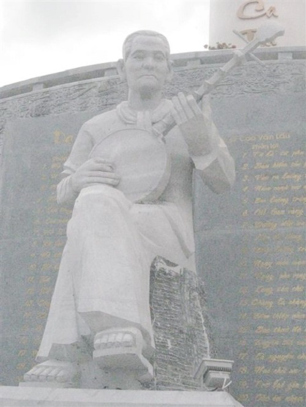
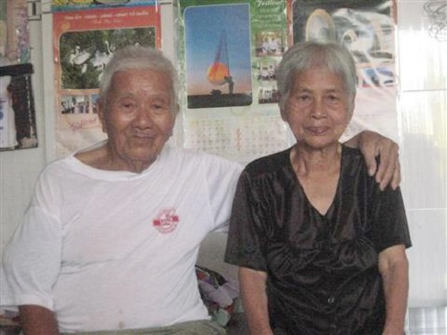

<!--
title: Con trai cố nhạc sĩ Cao Văn Lầu kể chuyện về bản ‘Dạ cổ hoài lang’
author: Nguyễn Tích Kỳ
status: completed
-->

**Câu chuyện về Cao Văn Lầu và bản nhạc trứ danh Dạ cổ hoài lang qua lời kể của người con duy nhất còn sống khiến người ta không khỏi bất ngờ. Ở tuổi 90, ông Cao Văn Hoai, thừa nhận mình đã “nhớ ít quên nhiều” nhưng vẫn luôn rất hào hứng khi kể về người cha tài hoa và người mẹ hiền hậu của mình.**

**Thầy đờn của Công tử Bạc Liêu**

Theo lời ông Cao Văn Hoai, gia đình ông có gốc gác ở Long An vì nghèo khó phải phiêu bạt xuống Bạc Liêu kiếm sống vậy mà nghèo vẫn hoàn nghèo. “Ông già (Cao Văn Lầu) từ nhỏ đã phải nương nhờ cửa chùa, đến tuổi đi học mới trở về với gia đình”. Nhưng tình yêu âm nhạc đã nảy nở trong lòng chàng trai Cao Văn Lầu (thường gọi là Sáu Lầu) khi nghe tiếng đờn trác tuyệt của Nhạc Khị – nhạc sư Lê Tài Khí lừng danh Nam Bộ, người có công san định 20 bài bản Tổ của nghệ thuật đờn ca tài tử, được giới tài tử xem như hậu Tổ. “ 15 tuổi, ông già xin theo học đờn kìm với thầy Nhạc Khị. Ổng học rất mau lại chăm chỉ, ham học nên được thầy cưng lắm. Nhạc Khị bị tật, đâu có thấy đường, mỗi lần dạy là bắt ổng ngồi sát bên chân. Ông già đờn, Nhạc Khị vừa đánh trống vừa nghe tiếng đờn. Đờn chịch (chệch) chữ nào là ổng quay roi trống đánh vào đầu cái cốp. Ông già đau lắm mà đâu dám khóc, lẳng lặng chùi nước mắt đờn tiếp”, ông Hoai kể. Sáu Lầu tiến bộ rất nhanh, chỉ vài năm ông đã thành thục các loại nhạc cụ (chuyên về tranh và kìm) và ghi danh vào làng tài tử Bạc Liêu vốn đầy rẫy nhân tài.

  
*Tượng cố nhạc sĩ Cao Văn Lầu tại Khu lưu niệm nhạc sĩ Cao Văn Lầu và nghệ thuật đờn ca tài tử tại Bạc Liêu*

“Cả đời ông già gắn với cây đờn, rong ruổi miết theo những cuộc chơi tài tử. Bất kể hội hè đình đám, giỗ quải, tang ma… ở đâu cũng đều rước ổng tới chơi. Ông ít khi ở nhà, cứ vác đờn dẫn anh em đi suốt có khi mấy ngày mấy đêm mới về. Tiếng tăm vang xa, nhiều người đến xin học. Mấy người nhà giàu đến tận nhà rước về dạy đờn hoài. Công tử Bạc Liêu, cậu Ba Trần Trinh Huy cũng là học trò của ổng. Mỗi lần cậu Ba mở tiệc hay rước hoa hậu, người đẹp từ Sài Gòn về chơi là đều mở cuộc đờn ca và cho xe rước ổng đến nhà chơi thâu đêm suốt sáng…” – ông Hoai kể.

Có thể nói, cuộc đời nhạc sĩ Cao Văn Lầu là một cuộc chơi tài tử bất tận. Là cuộc chơi nên rất tùy hứng. Ông nổi tiếng khó tính và không phải ai mời cũng chơi, chơi sao cũng được. Cuộc chơi của ông phải ở nơi chốn sạch sẽ, thoáng mát, thanh tĩnh và luôn bắt đầu bằng một cuộc rượu. Nơi nào gia chủ không biết ý chuẩn bị sơ sài hay nói năng không thuận là ông dắt anh em về liền. Là cuộc chơi nên dù tiếp xúc nhiều với giới thượng lưu ông vẫn cứ… nghèo: “Thời đó đờn ca tài tử đâu phải để kiếm tiền. Người ta rước đi chơi, đi dạy đờn khắp chốn nhưng thù lao là tùy tâm. Có người cho tiền, có người tặng đờn. Tài tử mà nên đa số chỉ tặng đờn, thêm đờn bạn bè tặng nữa nên đờn treo đầy nhà. Ông già đi thì thôi, ở nhà cực lắm, cũng phải còng lưng ngoài đồng, ngoài biển mò cua bắt ốc nuôi gia đình”.

“Khoảng năm 1945, Tây đàn áp dữ, phải tản cư vào Vĩnh Mỹ, ông già đem theo cây đờn kìm và đờn tranh để trong bao buộc chặt lại và giao cho tui giữ. Biết cha quý hai cây đờn, tui cũng xem như báu vật đi đâu cũng vác bên mình. Có lần trốn trong đồng, nằm trong mớ lúa buồn quá, nửa đêm ổng lấy đờn ra gảy, ai dè người dân nghe thấy bu lại nghe quá trời. Mấy bà nghe một hồi rồi sụt sùi khóc nói: “Bác Sáu ơi, nghe tiếng đờn của bác Sáu sao mà nhớ cha mẹ quá!”. Vậy là tối nào ổng cũng đờn, mọi người mến ổng lắm kêu ở lại luôn, không cho đi” – ông Hoai kể. Tiếng đờn của ông Sáu Lầu vang cả vào vùng giải phóng và được rước vào bưng dạy đờn, truyền nghề đờn ca tài tử cho anh em trong chiến khu.

  
*Ông Cao Văn Hoai – con trai thứ tư của cố nhạc sĩ Cao Văn Lầu – và vợ*

**Chuyện tình Dạ cổ hoài lang**

“Ba má tôi đến với nhau là do mai mối chứ ban đầu không xuất phát từ tình yêu. Thế mà từ đấy ra được bản Dạ cổ hoài lang danh tiếng”, ông Hoai thẳng thắn chia sẻ. Tuy không khởi đầu bằng tình yêu nhưng sự tận tụy, chịu thương chịu khó của người vợ trẻ – bà Trần Thị Tấn lấy ông Sáu Lầu khi mới 17 tuổi – chắc hẳn đã chinh phục con tim người nhạc sĩ tài hoa.

Ông Hoai kể: “Bà già giỏi lắm. Ban đêm đi bắt ba khía với ông già ngoài biển. Ba giờ sáng về, ông già còn ngủ được chứ bà lại tiếp tục gánh nước, giã gạo. Đến sáng là ra chợ bán hay đi làm lúa…, không lúc nào ngơi tay ngơi chân. Bà con hàng xóm thấy bà già làm dâu cực quá còn xúi trốn đi nữa kìa”. Cái tình, cái nghĩa ấy làm sao một tâm hồn nhạy cảm như ông Sáu Lầu có thể làm ngơ.

Sau ba năm hương lửa mặn nồng mà vẫn chưa có con, ông Sáu chết điếng khi nghe cha mẹ buộc phải bỏ vợ lấy người khác vì “tam niên vô tử bất thành thê”. Không thể trái lời, ông đành trả vợ về bên ngoại nhưng hễ có dịp chơi đờn ở đám tiệc là ông ghé về thăm vợ, có bao nhiêu tiền ông đưa cho bà hết. Tiễn ông về, bà phải nhìn cho đến khi bóng ông khuất dạng mới thôi. Thời gian đó, mỗi đêm người ta lại thấy ông Sáu Lầu ngồi ôm đờn thẫn thờ và không lâu sau Dạ cổ hoài lang ra đời. Trong tâm trạng nhớ nhung tột độ, ông đã đặt mình vào vị trí của người vợ đang mong nhớ chồng mà viết lên tiếng lòng tha thiết. Và thật không ngờ bản nhạc về nỗi đau chia ly của ông lại khởi đầu cho sự viên mãn cả sự nghiệp lẫn gia đình.

“Bác Hai biết chuyện ông già trốn đi thăm bà già nên cũng giúp nói gạt bà nội để giấu cho ổng. Rồi một người quen ở gần nhìn thấy tình cảnh tội quá nên nói ông già dẫn má về chỗ của bà cho tiện qua lại. Như vậy được mấy tháng thì bà già có thai. Ông già mừng quá rước bà về và 7 anh em tụi tôi (5 trai, 2 gái) lần lượt ra đời” – ông Hoai cười hạnh phúc.

Cả 7 anh em ông đều ít nhiều học được chút nghề của cha. Trong đó, có cậu Út Cao Văn Đàn bộc lộ tài năng âm nhạc từ sớm được ông Sáu Lầu truyền dạy tất cả sở học hứa hẹn nối tiếp xứng đáng người cha tài hoa. “Tiếc là nó mất sớm quá, bị giặc bắn lúc mới hơn 30 tuổi. Đến nay, tôi chỉ tiếc một điều là con cháu không nối tiếp được nghề của ông già thôi”.

Nhưng với chỉ một Dạ cổ hoài lang cũng đã đủ để cái tên Cao Văn Lầu trở thành bất tử. Mang tâm sự riêng của một cá nhân nhưng Dạ cổ hoài lang lại rất gần với nỗi niềm những người chinh phụ có chồng bị bắt lính tham chiến tại Pháp trong Chiến tranh thế giới thứ nhất nên nhanh chóng được hưởng ứng và lan tỏa. Lại ra đời trong giai đoạn phong trào đờn ca tài tử phát triển rộng khắp, sân khấu cải lương buổi đầu hình thành và phát triển mạnh mẽ, bản nhạc ngày càng phổ biến và kích thích sự sáng tạo của giới làm nghề. “Tôi nhớ hoài lời của cha mình là ông sáng tác Dạ cổ hoài lang nhằm để lại cho con cháu, dọn đường cho anh em theo đó mà đi. Dạ cổ hoài lang là bản gốc sẽ biến ra hàng ngàn nhánh mà mỗi nhánh có bông hoa lá khác nhau”.

Ngày 18/7/1976, nhạc sĩ Cao Văn Lầu qua đời. Giữa những bạn đờn, học trò, bỗng xuất hiện một ông lão hát rong mang theo một cây đờn guitar đến xin viếng. Gia đình từ chối phúng điếu ông bèn xin được hát cúng: ông ngồi đờn và ca một bản vọng cổ để đưa tiễn chủ nhân bản Dạ cổ hoài lang, tiền thân bản vọng cổ mà nhờ đó ông nuôi sống cả gia đình mình, rồi lặng lẽ ra đi không ai kịp hỏi danh tính…

***Cập nhật: 06/06/2014 – 06:56***  
***Nguồn Hội Nhạc sĩ Việt Nam***  
***Ninh Lộc***  

