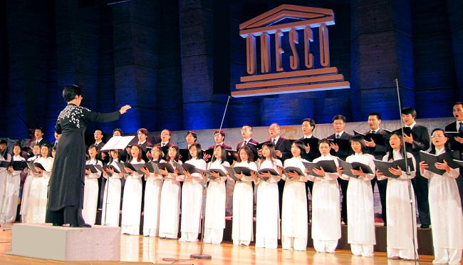
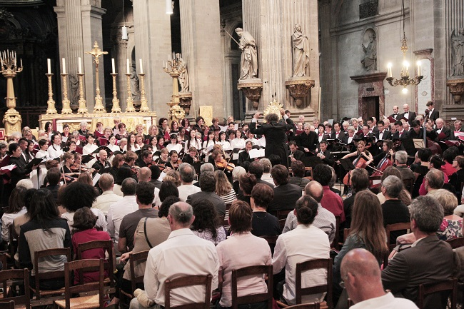
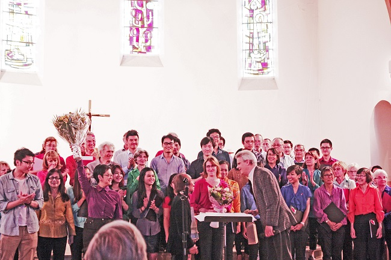

<!--
title: Hành trình 5 năm của Hợp Ca Quê Hương
author: Tich Ky
-->

**Từ Alfortville đến hành trình 5 năm của Hợp Ca Quê Hương**

Gần đây, những người yêu mến Hợp ca Quê hương có dịp được xem lại những tư liệu về một số chương trình biểu diễn trên chặng đường 5 năm xây dựng và phát triển của Hợp ca. Trong đó,  buổi trình diễn của Hợp Ca Quê Hương tại thị trấn Alfortville vào năm 2012 là một điểm nhấn đầy ấn tượng. Đây là buổi biểu diễn từ thiện nhằm ủng hộ trẻ em bị nhiễm chất độc màu da cam của làng hữu nghị Vân Canh. Thật không khỏi tự hào và xúc động khi nhìn lại những hình ảnh trong buổi biểu diễn hôm đấy của Hợp Ca.

« Người Hà Nội », Tác phẩm bất hủ của Nguyễn Đình Thi, tác phẩm nền móng của Hợp Ca, với những giai điệu lúc hào hùng, lúc da diết đã được Hợp Ca trình bày rất thành công. Tác phẩm làm cho người xem hình dung ra bức tranh của đất nước một thời khói lửa mà vẫn hào hoa. Bên cạnh đó, những « Trường ca sông Lô » của Văn Cao, « Du kích sông Thao » của Đỗ Nhuận, rồi « Hồi tưởng » của Hoàng Vân, những tác phẩm kinh điển của âm nhạc cách mạng Việt nam đều đã như được sống lại dưới sự thể hiện độc đáo và tinh tế của dàn hợp xướng Hợp Ca Quê Hương. Nếu như những tác phẩm kinh điển kể trên qua sự thể hiện của các thành viên Hợp Ca làm nổi bật lên không khí sôi sục của toàn dân tộc trong thời kỳ hoa lửa thì những tác phẩm như « Trăng chiều » của Đặng Hữu Phúc lại mang tới cho người xem một không gian lãng mạn, trữ tình với những giai điệu bay bổng nhẹ nhàng của tình yêu. Ngoài ra, Hợp Ca Quê Hương, trong buổi biểu diễn ở Alfortville, còn ghi đậm dấu ấn qua tác phẩm dân ca bắc bộ « Trống Cơm » và một tác phẩm nổi tiếng của âm nhạc cổ điển Ý – Nabucco của nhà soạn nhạc thiên tài Verdi.

Từ buổi biểu diễn ở Alforville hôm nào, nhìn lại chặng đường đã đi qua, những người quan tâm và yêu mến Hợp ca Quê hương hẳn sẽ ấn tượng với sự trưởng thành không ngừng của một dàn hợp xướng Việt Nam trên đất Pháp. Những tác phẩm trình diễn ngày càng phong phú. Chất lượng biểu diễn ngày càng được hoàn thiện. Hợp Ca Quê Hương đã trở thành lực lượng quan trọng, đi đầu trong các hoạt động văn hóa, văn nghệ của cộng đồng người Việt tại Pháp, góp phần xứng đáng trong việc đưa văn hóa Việt Nam đến với cộng đồng.

Giai đoạn hiện nay, Hợp Ca Quê Hương đang có những bước tiến mới ngày càng vững chắc. Hợp ca không ngừng trau chuốt, luyện tập làm cho chất lượng của Nhóm ngày càng tốt lên. Càng ngày, kho tài liệu các tác phẩm được trình diễn bởi Hợp Ca ngày càng nhiều, đa dạng và phong phú, không còn là chỉ những tác phẩm tiếng Việt mà còn thêm những tác phẩm kinh điển nước ngoài. Đặc biệt, Hợp Ca đang mở rộng nhiều sự hợp tác với các nhóm hợp xướng của Pháp nhằm giao lưu và học hỏi và nhằm quảng bá văn hóa âm nhạc Việt Nam tới bạn bè quốc tế .

Bạn có thể nghe nhìn trên youtube

Hợp Ca Quê Hương trình diễn chung với dàn hợp xướng của nhạc trưởng nổi tiếng Hugues Reiner trong một chương trình hòa nhạc Requiem Mozart và Bizet ngày 03/7/2014 tại nhà thờ Saint Sulpice-Paris.

https://www.youtube.com/watch?v=rb_7sJSO88U&feature=youtu.be
https://www.youtube.com/watch?v=kFgJW5w6Ohk&feature=youtu.be
https://www.youtube.com/watch?v=5JULQAs48Eg&feature=youtu.be
https://www.youtube.com/watch?v=KIKXnOHYlEE&feature=youtu.be

Ngoài ra, nhân dịp « Ngày lễ hội Âm Nhạc » ở Pháp 21/6/2014 vừa qua, Hợp Ca Quê Hương đã hợp tác tốt với dàn hợp xướng Polyphonique của thị trấn Choisy Le Roi dưới sự chỉ huy của nhạc trưởng Laurent Boer và nhạc sỹ Nguyễn Thiện Đạo.                                

https://www.youtube.com/watch?v=NQIonQHuZb4

Tháng 12 năm nay, dàn hợp xướng của thị trấn Choisy Le Roi sẽ góp sức cùng với Hợp Ca Quê Hương và cùng với dàn nhạc giao hưởng của thành phố Rouen biểu diễn tác phẩm Cantique de Jean Racine của Gabriel Fauré và một bài dân ca Việt Nam được nhạc trưởng Claude Brendel chuyển soạn cho hợp xướng 4 bè và tác phẩm hợp xướng bốn chương nổi tiếng của nhạc sĩ Tô Hải « Tiếng Hát Người Chiến Sĩ Biên Thùy » tại hai thành phố Rouen và Paris. 

Nhóm thông tin Hợp Ca Quê Hương
Paris 2414
 

 