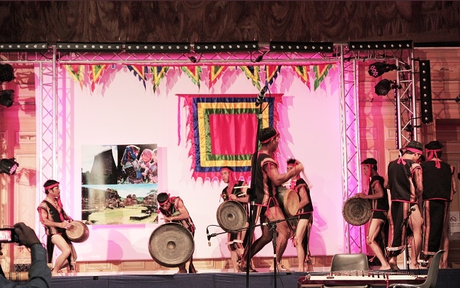
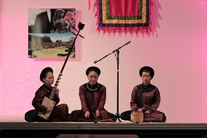
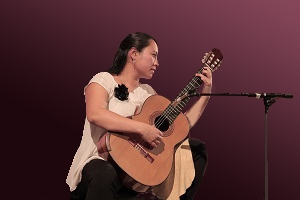
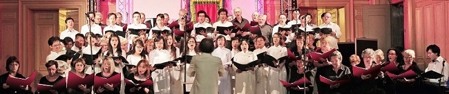

<!--
title: Hợp Ca Quê Hương biểu diễn tại tòa thị chính quận 13, Paris
author: Đâu Xuân Tuấn
-->

*Vào ngày 04/07/2014 vừa qua, Hợp Ca Quê Hương đã tham gia vào chương trình nghệ thuật mang tên « Hồn Việt » tại tòa thị chính quận 13, Paris trong khuôn khổ kỷ niệm 40 năm thiết lập quan hệ ngoại giao giữa Việt Nam và Pháp và năm Việt Nam tại Pháp. Với những tiết mục đặc sắc được dàn dựng kỹ lưỡng cùng sự tham gia nhiệt tình của các nghệ sĩ  tại Pháp và nghệ sĩ đến từ Việt Nam, chương trình đã đưa người xem đến với một không gian văn hóa Việt Nam đúng như tên gọi « Hồn Việt » của nó. « Hồn Việt » là một chương trình giao lưu ca, múa, nhạc do Trung tâm Văn hóa Việt Nam phối hợp với các cơ quan, hội, đoàn của Việt Nam tại Pháp thực hiện, dưới sự bảo trợ của Ngài Jérôme Coumet, Thị trưởng Quận 13 – thành phố Paris. Đây cũng là lần thứ hai, TTVHVN tổ chức chương trình  ca múa nhạc Việt nam tại địa điểm này. Ngoài Hợp Ca Quê Hương, chương trình còn có sự góp mặt của các nghệ nhân biểu diễn cồng chiêng Tây nguyên*

*Ca trù đến từ Việt Nam. Ca trù đến từ Việt Nam. Đặc biệt, chương trình có sự tham gia nhiệt tình của nghệ sỹ guitare cổ điển Thanh Hằng và Ensemble Polyphonique de Choisy-Le-Roi dưới sự dẫn dắt của nhạc trưởng Laurent Boer.*

 

*Từ lâu, Hợp Ca Quê Hương được biết tới là một câu lạc bộ âm nhạc hoạt động với mục tiêu đưa âm nhạc Việt Nam đến gần hơn với công chúng Pháp thông qua các bản hợp xướng. Và, thứ 6 vừa qua, khán giả lại được thưởng thức những màn trình diễn độc đáo của Hợp Ca. Một lần nữa, bản hợp xướng bốn bè kinh điển « Tiếng hát người chiến sĩ biên thùy » của nhac sĩ Tô Hải lại hào hùng vang lên giữa Paris, gợi lại ký ức về một thời oanh liệt của dân tộc.Sự hòa giọng của các nghệ sỹ Pháp trong dàn hợp xướng Choisy Le Roi đã mang đến cho màn hợp xướng « Tiếng hát người chiến sĩ biên thùy » lần này thêm hoành tráng và ấn tượng. Cũng trong chương trình, hai dàn hợp xướng đã cùng nhau thể hiện rất thành công tác phẩm Nabucco của nhà soạn nhạc thiên tài người Ý, Verdi bằng cả tiếng Ý và tiếng Việt, dưới sự chỉ huy lần lượt của hai nhạc trưởng Laurent Boer và Nguyễn Thiện Đạo.*

*Có thể nói, những phần trình diễn hợp xướng của Hợp Ca Quê Hương luôn là những điểm nhấn quan trọng trong các chương trình nghệ thuật Việt Nam tại Pháp có sự tham gia của Hợp Ca. Những bản hợp xướng được Hợp ca Quê hương trình diễn ngày 4/7 vừa qua một lần nữa đã được khán giả đón nhận nồng nhiệt bằng những tràng pháo tay không ngớt. Hợp Ca Quê Hương đang ngày càng tiến bộ hơn, vững chắc hơn với ngày càng nhiều bản hợp xướng được thể hiện và chất lượng biểu diễn ngày càng tốt lên. Thật tự hào khi nhìn thấy sự lớn mạnh của Hợp Ca Quê Hương – dàn hợp xướng đậm chất Việt trên đất Pháp.*

*Đậu Xuân Tuấn  
11 Tháng 7 2014*