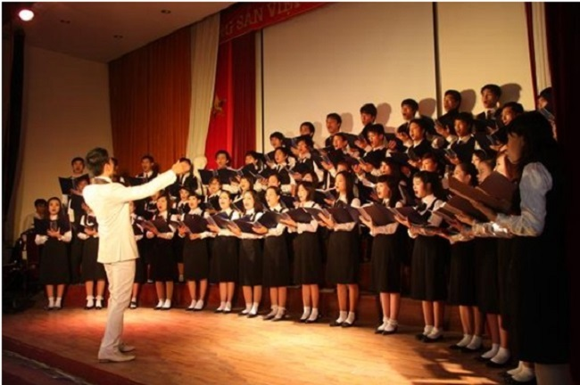

<!--
title: Vai trò của nghệ thuật hợp xướng trong đời sống âm nhạc
author:  Nguyễn Tích Kỳ
status: completed
-->

Cập nhật: 17/12/2014 – 06:30

Lê Vinh Hưng

Hợp xướng là loại hình nghệ thuật âm nhạc được biểu hiện bằng giọng hát nhiều bè. Mỗi bè có cách thức trình diễn riêng tương đối độc lập về âm điệu và nhịp điệu, song liên kết hài hòa với nhau trong một chỉnh thể âm nhạc. Với đặc trưng cơ bản đó, hợp xướng thực chất là lối diễn tấu tập thể nhằm liên kết thống nhất tư tưởng, tình cảm của một cộng đồng nghệ sĩ trong một tác phẩm âm nhạc độc lập hoặc trong các thể loại âm nhạc khác như nhạc kịch, thanh xướng kịch, giao hưởng… Dù theo cách nào, thì hợp xướng cũng được coi là một trong những phương tiện âm nhạc để chuyển tải tiếng nói đồng vọng của quần chúng, đồng thời là công cụ hiệu quả nhất để tạo màu sắc cho sân khấu âm nhạc, thậm chí tạo ra *kịch tính âm nhạc*.

  
*Ảnh minh họa. Nguồn: Internet*

**Trong giáo dục âm nhạc cộng đồng**

Có thể nói giọng người là một trong những nhạc cụ đẹp, tiện dụng nhất với việc thể hiện hình tượng nghệ thuật nhằm phản ánh thế giới quan, nhân sinh quan, trong sự phát triển đời sống cộng đồng xã hội. Ngôn ngữ âm nhạc của hợp xướng vốn có thế mạnh trong việc gợi lên hình tượng nghệ thuật và làm cho hình tượng nghệ thuật dội thẳng vào con tim trước khi vọng lên trí óc của người thưởng thức. Âm nhạc và lời ca của hợp xướng được tổ chức chặt chẽ theo một hệ thống khúc thức logic đem lại khả năng phản ánh cuộc sống đa dạng, phong phú của con người. Niềm vui và nỗi đau thương, sự say mê lao động và niềm hạnh phúc… luôn được sống dậy một cách kỳ ảo trong âm điệu và nhịp điệu của hợp xướng. Đến lượt nó, tiếng nói đồng vọng của dàn hợp xướng lại có sức hòa chung nhịp đập trái tim người thưởng thức để cảm hóa, khơi dậy vốn văn hóa âm nhạc cùng tâm hồn cao thượng của họ.

Lẽ dĩ nhiên, nghệ thuật hợp xướng không tồn tại tách biệt khỏi các loại hình nghệ thuật khác như văn học, thơ ca, vũ đạo, hội họa, sân khấu… Hợp xướng cũng tích hợp trong nó các giá trị văn hóa phổ biến như ngôn ngữ, bản sắc dân tộc, tín ngưỡng, tôn giáo, trang phục… Song, với lợi thế ngôn ngữ riêng là thế giới âm thanh, hợp xướng thu hút người thưởng thức trước hết bằng cái hay, cái đẹp của giọng người . Có bao nhiêu nét tinh tế trong đời sống tinh thần của con người thì có bấy nhiêu nét tinh tế trong ngôn ngữ âm nhạc hợp xướng. Có thể nói, hợp xướng không những hát mà còn vẽ, múa, kể chuyện, hối thúc, khuyên nhủ và dạy học được. Chính vì vậy, nói đến vai trò giáo dục của nghệ thuật hợp xướng là nói đến sự tác động trực tiếp, mạnh mẽ của hệ thống âm thanh và lời ca đã được nhào nặn nhuần nhụy vào tâm tư, tình cảm của người nghe, qua đó làm cho họ tự điều chỉnh nhân cách.

Lịch sử nhân loại đã ghi lại khả năng kỳ diệu của nghệ thuật hợp xướng trong việc thể hiện lý tưởng đạo đức của thời đại, giai cấp, của bản thân người nghệ sĩ. Sức sống mãnh liệt cũng như khả năng truyền cảm mạnh mẽ của các tác phẩm hợp xướng luôn có tác dụng động viên, cổ vũ con người và cộng đồng khát khao vươn tới chân giá trị của cuộc sống nói chung và đời sống âm nhạc nói riêng. Hơn thế, những nét tinh tế của âm nhạc và lời ca trong tác phẩm thường là cái tinh tế được chọn lọc, điển hình hóa và kết tinh cao độ truyền thống của mỗi dân tộc. Một khi những giá trị ấy được ngấm sâu vào tâm hồn con người thì sẽ trở thành sự tinh tế, mẫu mực trong tư tưởng, tình cảm, đạo đức, phong thái, ứng xử, hành động… của con người.

**Trong định hình giá trị thẩm mỹ âm nhạc**

Hợp xướng không chỉ là nghệ thuật dùng âm thanh giọng người làm phương tiện phản ánh cuộc sống, mà nó thực sự là mét khoa học. Nhà soạn nhạc phản ánh thế giới không phải bằng sự ngẫu hứng thuần túy, tùy tiện mà bao giờ cũng dựa trên những nguyên tắc khoa học về sự kết hợp, nối tiếp cũng như khả năng hòa hợp giữa âm nhạc và lời ca, khúc thức, phối giọng, phối khí sao cho phù hợp với sự phát triển tâm – sinh lý của người nghe. Để tạo nên sự thống nhất mang tính chỉnh thể của một tác phẩm âm nhạc, đặc biệt là sự ăn nhập giữa âm nhạc và lời ca, giữa giọng người và dàn nhạc, người sáng tác không thể khiên cưỡng, gò ép mà phải xuất phát từ chính cảm xúc chân thực cùng sự lao động khoa học nhằm không ngừng hoàn thiện tác phẩm nghệ thuật. Đó còn là quá trình kết hợp giữa cái riêng, cảm xúc tức thời của nghệ sĩ với cái phổ quát từ dấu ấn, hơi thở của dân tộc, thời đại – một quá trình đòi hỏi người nghệ sĩ cũng như người thưởng thức phải có sự hiểu biết khoa học về âm nhạc. Sự thống nhất giữa khoa học và nghệ thuật trong hợp xướng cũng chính là chìa khóa để con người nâng cao cảm xúc, thị hiếu và lý tưởng thẩm mỹ âm nhạc trong hoạt động xã hội, giúp họ phân biệt được cái giản dị với sự nghèo nàn, giữa tâm hồn giàu tình cảm với sự đa cảm bệnh hoạn… Càng hiểu biết âm nhạc hợp xướng một cách đúng đắn, khoa học, sâu sắc thì con người càng gắn bó với âm nhạc, sử dụng âm nhạc để phát triển trí tuệ và nuôi dưỡng tâm hồn mình, bồi bổ cốt cách và không ngừng vươn tới chân, thiện, mỹ.

Giá trị thẩm mỹ do hợp xướng đem lại thể hiện ở chỗ nó tác động mạnh về cảm xúc, thức tỉnh ngay trong bản thân người nghe về cái đẹp, qua đó nâng cao khả năng nhận thức thẩm mỹ của người thưởng thức. Một tác phẩm hợp xướng hay, bao giờ cũng chứa đựng hệ giá trị chân, thiện, mỹ thể hiện tập trung lý tưởng cao đẹp của nhân loại, làm cho người nghe nhận thức được thế giới bằng cảm xúc âm nhạc – lời ca một cách có chiều sâu theo các quy luật tình cảm riêng. Con người có thể thông qua nghệ thuật hợp xướng để mở rộng nhận thức về thế giới và hoàn thiện các mối quan hệ của chính mình với thế giới. Nhờ sự thể hiện bằng giọng hát vô cùng sống động, cụ thể và cảm tính, hợp xướng không chỉ mang lại lợi ích thẩm mỹ mà còn cung cấp kinh nghiệm và vốn sống cho người thưởng thức. Hơn nữa, tính chất nhiều bè, nhiều giọng của hợp xướng tạo ra khả năng nhận thức nhiều cấp độ, nhiều ý nghĩa, nhìn thấy cả cái bên ngoài lẫn cái bên trong, cả hiện tại quá khứ và tương lai cho người thưởng thức.

Đặc biệt, sự định hình giá trị thẩm mỹ âm nhạc đối với con người và cộng đồng của hợp xướng được thể hiện ở tiềm năng to lớn của nó trong hình thành cảm xúc thẩm mỹ, thị hiếu thẩm mỹ và lý tưởng thẩm mỹ đúng đắn. Hợp xướng, bằng cách thức riêng nó, còn có vai trò quan trọng liên kết con người với con người, cộng đồng, dân tộc và thời đại. Trong giao lưu văn hóa quốc tế, mọi người dù khác nhau về tiếng nói, nhưng đều có thể giao tiếp thân thiện với nhau nhờ đứng chung trong một dàn hợp xướng. Thực tiễn lịch sử âm nhạc thế giới cho thấy, đã có những bản hợp xướng nổi tiếng vượt khỏi biên giới quốc gia để trở thành di sản chung của nhân loại, điển hình như *Chương 4 trong Giao hưởng số 9 của L.V. Beethoven*.

**Trong việc nâng cao thị hiếu âm nhạc của con người và cộng đồng**

Có thể nhìn nhận khái quát rằng, vấn đề quan trọng nhất của đời sống âm nhạc chính là thính giả. Dù có những nhạc sĩ, ca sĩ tài ba cũng sẽ ít có giá trị cống hiến và kém phát triển nếu công chúng thưởng thức âm nhạc thờ ơ. Trong đời sống âm nhạc, ngoài những chân giá trị, không thể không thừa nhận còn có những xu hướng, thị hiếu thiếu lành mạnh, những diễn biến phức tạp, ảnh hưởng đa chiều tới sự phát triển nhân cách của các lứa tuổi, tầng lớp xã hội. Trách nhiệm của nghệ thuật âm nhạc nói chung, của nghệ thuật hợp xướng nói riêng là đấu tranh loại bỏ những xu hướng thị hiếu âm nhạc thiếu lành mạnh ấy bằng chính sức mạnh âm nhạc.

Hợp xướng có lợi thế lớn nhờ đặc trưng kết hợp hài hòa giữa âm nhạc với lời ca, nên nó không chỉ góp phần đáp ứng nhu cầu, thị hiếu của công chúng mà còn xây dựng, uốn nắn thị hiếu âm nhạc, làm cho âm nhạc thực sự trở thành vũ khí đặc biệt để chiếm và giữ được con người.

**Với hoạt động sáng tác âm nhạc**

Nghệ thuật thanh nhạc nói chung và hợp xướng nói riêng có vai trò không nhỏ trong việc tạo tiền đề, cơ sở và động lực của lao động sáng tạo, đồng thời hỗ trợ đắc lực cho công việc của người sáng tác âm nhạc. Trong thực tiễn đời sống âm nhạc thì nhạc sĩ được công chúng biết đến nhiều hơn cả, nếu họ quan tâm đến cả sáng tác thanh nhạc và khí nhạc.

Vai trò của nghệ thuật hợp xướng đối với hoạt động sáng tác âm nhạc thể hiện trước hết ở việc *cung cấp dữ liệu, chất liệu âm nhạc* cho công việc sáng tác. Những bài hòa thanh bốn bè theo kiểu học đường mới chỉ là kiến thức tiền đề. Tuy nhiên, trong thực tiễn thì những bài fuy gơ và những bài hòa âm sạch sẽ, người ta thường chưa chú ý đến hiệu quả thật của các giọng (ví dụ: thường các bè nữ trầm viết quá thấp, do đó mất cân bằng với các bè nữ cao và nam cao; đôi khi bè nam trầm viết cách quá xa với những bè khác, nên khó có thể hòa hợp với nhau). Đối với bài tập ở trường, người ta đã cấm hoặc tránh một số cách dùng cho là không tốt, song thực tế cách dùng này khi áp dụng vào giọng hát lại rất tốt. Ngay cả các nhạc sĩ nổi tiếng như J.S. Bach, W.A. Mozart cũng đã viết những đoạn nhạc với hòa âm có vẻ phạm vào lỗi cấm theo luật hòa thanh, nhưng lại có hiệu quả tốt đối với giọng hát. Mặt khác, nhiều đoạn của các bài fuy gơ hoặc bài làm hòa thanh được giải ở các kỳ thi, khi dựng bằng giọng hát lại ít hiệu quả so với khi dùng cho đàn dây, đàn oóc gơ hoặc piano. Bởi vậy, khi viết cho hợp xướng, phải luôn căn cứ trên cơ sở âm vang thật của các giọng và những kinh nghiệm thực tiễn trong quá trình sáng tác hợp xướng mang lại.

Hợp xướng cũng giúp gợi mở ý tưởng cho sáng tác các thể loại âm nhạc khác. Các nhạc sĩ muốn viết được thể loại âm nhạc lớn như thanh xướng kịch, opera… thì cần có sự hiểu biết về nghệ thuật và kỹ thuật viết hợp xướng, bởi hợp xướng là một thành phần quan trọng trong các thể loại âm nhạc đó. Việc viết tác phẩm hợp xướng đòi hỏi người sáng tác vừa có cảm xúc âm nhạc sâu sắc, vừa có tri thức khoa học về tổ chức âm thanh, hòa âm, phối giọng, phối khí… Không những thế, nhạc sĩ còn phải thấu hiểu cả về khả năng biểu hiện và phối hợp của các loại giọng, chất giọng, cách nhấn chữ của các loại giọng, cách phát âm, âm khu và sắc thái biểu hiện, cân bằng âm lượng giữa các bè. Thông qua các động thái này, mà hợp xướng giúp gợi mở được nhiều ý tưởng trong việc sáng tác các thể loại âm nhạc khác với tính cách kế thừa và phát triển từ ngôn ngữ hợp xướng.

Nghệ thuật hợp xướng còn đóng góp vào lĩnh vực sáng tác âm nhạc thông qua vai trò kích thích và phát triển, hội nhập cùng các nước tiên tiến, đồng thời khai thác thành tựu hội nhập để cống hiến trở lại cho việc sáng tạo nghệ thuật hợp xướng. Rõ ràng, qua giao lưu văn hóa âm nhạc, mà hợp xướng ở mỗi quốc gia trở thành một trong những phương tiện hữu hiệu để khẳng định chân giá trị và làm tỏa sáng tính dân tộc độc đáo của mình. Mặt khác, qua giao lưu, hội nhập, những tinh hoa âm nhạc mang tính quốc tế, tính đương đại… sẽ được hợp xướng ứng dụng một cách trực tiếp và thuận lợi nhất để làm nảy sinh các khuynh hướng sáng tác âm nhạc lành mạnh, tiên tiến ở nước mình.

**Với hoạt động biểu diễn âm nhạc**

Hoạt động biểu diễn hợp xướng sẽ thúc đẩy cả hai khuynh hướng biểu diễn âm nhạc nghiêm túc và thông tục vốn tồn tại và phát triển song song hiện nay. Hợp xướng, với tính cách là một thể loại âm nhạc, vừa mang tính chuyên nghiệp, đồng thời vừa mang tính phổ cập, dễ hiểu, gần với công chúng hơn so với những loại hình biểu diễn âm nhạc dành cho dàn nhạc giao hưởng. Việc biểu diễn những bản hợp xướng của các nhạc sĩ cổ điển cũng như đương đại là một phương diện nâng cao giá trị ưu tú của âm nhạc bác học, đồng thời tạo điều kiện cho sự phát triển những thị hiếu đúng đắn của công chúng. Đặc biệt, một hình thức biểu diễn hợp xướng đã được thịnh hành từ lâu là a cappella có thể đạt hiệu quả rất tốt giúp cho các thành viên của dàn hợp xướng có sự trải nghiệm tuyệt vời cả phương diện âm nhạc, giáo dục và văn hóa. Đây còn là thể thức có ưu thế rất mạnh trong biểu diễn thanh nhạc, trau dồi học thuật, tọa đàm học thuật.

Lĩnh vực biểu diễn hợp xướng được phát triển thỏa đáng còn mang lại cơ hội tiếp xúc với khán giả trong và ngoài nước, tăng cường sự hiểu biết lẫn nhau giữa con người Việt Nam và các nước khác.

**Với hoạt động chỉ huy âm nhạc**

Nghệ thuật hợp xướng đã trở thành bộ phận không thể thiếu trong kho tàng âm nhạc của nhân loại. Cho nên, đào tạo chỉ huy hợp xướng cùng với nghiên cứu khả năng của giọng người, các thủ pháp chỉ huy… nhất thiết phải gắn với việc nghiên cứu tác phẩm của các bậc thày viết cho thanh nhạc. Ngay cả đối với đào tạo chỉ huy dàn nhạc nói chung, cũng cần tăng cơ hội nghe hợp xướng để nâng cao kỹ năng chỉ huy.

Công việc chỉ huy hợp xướng bắt đầu từ nghiên cứu tác phẩm hợp xướng, phân tích cấu trúc của nó, chia tác phẩm hợp xướng ra thành từng đoạn để hiểu các đoạn này hòa nhập vào chỉnh thể thống nhất… Để xử lý thành công tổng phổ hợp xướng và dàn nhạc, người chỉ huy cần phải biết tự đặt mình vào các vị trí khác trong dàn hợp xướng, dù đó chỉ là vị trí khiêm tốn của một diễn viên hát bè. Mặt khác, việc xử lý tác phẩm, đảm bảo sự cân bằng giữa dàn nhạc và hợp xướng là vấn đề hết sức phức tạp. Người chỉ huy hợp xướng dễ mắc sai lầm, khiếm khuyết nếu không am hiểu về thanh nhạc, cũng như không cân đối được liều lượng để đạt hiệu quả hài hòa, phá vỡ cấu trúc tổng thể của hợp xướng. Điều đó sẽ dẫn đến việc biểu diễn tác phẩm không thành công, cho dù tác phẩm đó có giá trị.

**Với sự phát triển thanh nhạc**

Mối liên hệ hữu cơ giữa hợp xướng với các thể loại thanh nhạc khác thể hiện ở sự tương tác thúc đẩy nhau cùng phát triển, đặc biệt là chuyển hóa lẫn nhau rất nhuần nhuyễn. Chính từ sinh hoạt âm nhạc hợp xướng mà làm nảy sinh những tinh túy của giọng hát. Ngược lại, một giọng hát hay nếu từng đứng vững trên nền hợp xướng thì trở nên có giá trị gấp bội. Lịch sử âm nhạc đã chứng kiến rất nhiều nhạc sĩ, nghệ sĩ nổi tiếng thế giới như J.S. Bach, J.S.Haydn, R.Schumann, F.Mendelssohn, H.Berlioz… đã từng tham gia dàn hợp xướng. Âm nhạc hợp xướng là mạch nguồn vô tận sản sinh ra những tài năng thanh nhạc, và ngược lại, bản thân âm nhạc hợp xướng cũng phải nhờ những tinh túy thanh nhạc để tự nâng mình lên. Chính quá trình tương tác, chuyển hóa hữu cơ ấy làm cho nghệ thuật âm nhạc nói chung, nghệ thuật hợp xướng nói riêng không ngừng phát triển và hoàn thiện về cả phương diện nghệ thuật và phương diện khoa học âm nhạc.

***Nguồn: Tạp chí VHNT số 361, tháng 7-2014***

