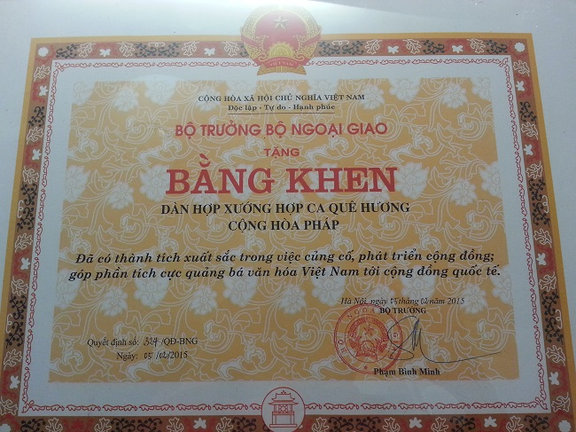
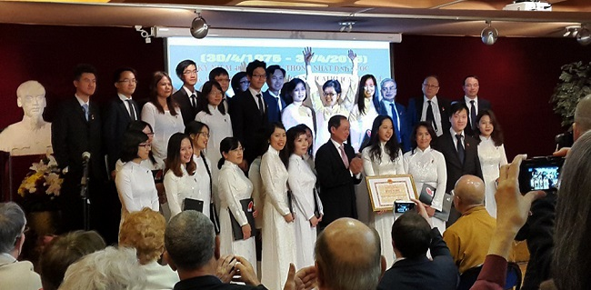
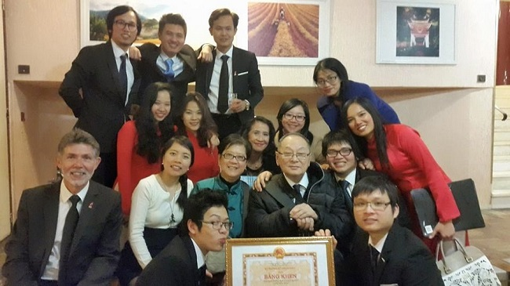

<!--
title: Được khen thưởng
author: Tich Ky
-->

Hợp ca Quê Hương rất phấn khởi và tự hào khi nhận được thông báo từ Đại Sứ Quán Việt Nam tại Pháp: ” Ghi nhận những thành tích xuất sắc trong việc củng cố, phát triển cộng đồng, góp phần tích cực quảng bá văn hóa Việt Nam tới cộng đồng quốc tế, Bộ trưởng Bộ Ngoại giao quyết định tặng Bằng khen cho Dàn hợp xướng Hợp ca Quê hương” .

 Lấy lại bình tĩnh sau những phút giây xúc động ban đầu, tôi đã ôn lại chặng đường mà Hợp ca Quê Hương đã đi qua từ 6 năm nay…

Nếu nhìn lại chặng đường đã đi qua để nói rằng “nước lã mà khuấy nên hồ” thì cũng không sai, vì Hợp ca Quê Hương chúng tôi đã khởi đầu gần như từ con số 0. Nhưng nói như vậy cũng không hoàn toàn chính xác. Thời gian qua đi càng giúp tôi nhận thức sâu sắc được rằng chúng tôi, thực ra, đã khởi đầu với một hành trang vô cùng quan trọng : tình yêu và sự đam mê.

Hợp ca Quê Hương ra đời trước tiên là vì tình yêu cháy bỏng của chúng tôi với âm nhạc Việt Nam, những người muốn góp phần nhỏ bé của mình vào việc duy trì và củng cố một truyền thống của cộng đồng đã được hình thành từ nhiều thập niên của kiều bào ta tại Pháp — truyền thống tôn vinh các ca khúc của dòng nhạc cách mạng thông qua hình thức hát hợp xướng.

Chúng tôi cũng mong muốn, sẽ đến một ngày, những câu nói giống như lời mở đầu trong phóng sự gần đây của VTV4 về Hợp ca Quê Hương rằng : “giữa trời Paris mà được nghe Giai điệu Tổ quốc cất lên da diết” sẽ không còn hàm ý về một sự ngạc nhiên nữa.  Cũng giống như tới Paris mà được thưởng thức các món ăn Việt Nam thì không phải là chuyện lạ!

Cùng với thời gian,và theo sự phát triển tự nhiên, Hợp ca Quê Hương đã từng bước tiếp cận bạn bè quốc tế gần xa để quảng bá dòng nhạc này tới họ, giúp họ thêm hiểu và thêm yêu đất nước và con người Việt Nam.

Nhưng chính ở điểm này, tôi cũng muốn nhấn mạnh chân lý “hữu xạ tự nhiên hương”.

Chính sự đam mê của từng thành viên Hợp ca Quê Hương, nét đẹp và giá trị nghệ thuật của dòng nhạc cách mạng Việt Nam đã là một sức hấp dẫn tự nhiên khiến rất nhiều bạn bè quốc tế, từ không chuyên đến chuyên nghiệp, đã đồng cảm, yêu mến, rồi tìm đến hỗ trợ và hợp tác với Hợp ca Quê Hương.

Vì thế mới có câu chuyện bản hùng ca “Người Hà Nội” đã được hát bởi một dàn hợp xướng đa quốc tịch giữa quảng trường UNESCO, hay “cantata Việt Nam” “Tiếng hát người chiến sỹ biên thùy” được phục dựng trọn vẹn trên đất Pháp bởi ba nhạc trưởng nổi tiếng của Pháp — Claude Brendel, Laurent Boer và Hugues Reiner  – cùng với dàn nhạc giao hưởng của Nhạc viện Rouen và hai dàn hợp xướng Pháp-Việt, trong đó lực lượng nòng cốt là HCQH…

Khi xây dựng Hợp ca Quê Hương, quả thật chúng tôi không mơ tới bất kỳ  sự “khen thưởng” nào. Được thấy những nốt nhạc, thanh âm của dòng nhạc độc đáo của đất nước vang lên phục vụ cộng đồng Việt Nam trên đất khách, được cộng đồng và bạn bè quốc tế nâng niu, trân quý, đã là một phần thưởng, một sự khích lệ vô giá.

Nhưng khi được Bộ Ngoại giao Việt Nam ghi nhận và tôn vinh thì chúng tôi càng cảm thấy được khích lệ, động viên. Chúng tôi trân trọng và coi đó là những tình cảm chân thật nhất và chỉ có thể có được từ những người bạn lớn, những người đồng hành. Chúng tôi thật lòng biết ơn vì điều đó.

Niềm vui hôm nay, đến đúng dịp Hợp ca Quê Hương kỷ niệm sinh nhật lần thứ 6, chắc chắn sẽ giúp nhân lên gấp bội tình yêu và sự đam mê của mỗi thành viên Hợp ca Quê Hương đối với dòng nhạc chúng tôi đã, đang và sẽ tiếp tục theo đuổi.  

NTK – Paris, 26/4/201

 