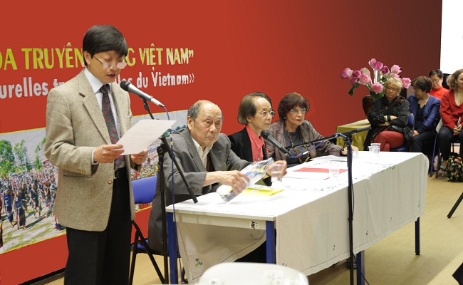
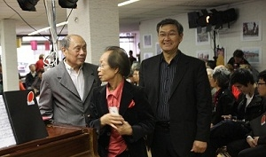
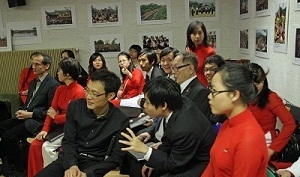
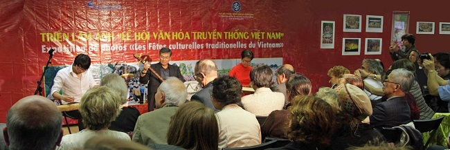
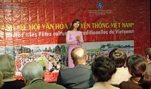
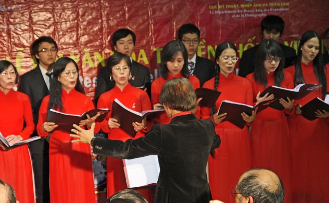
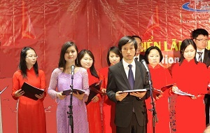
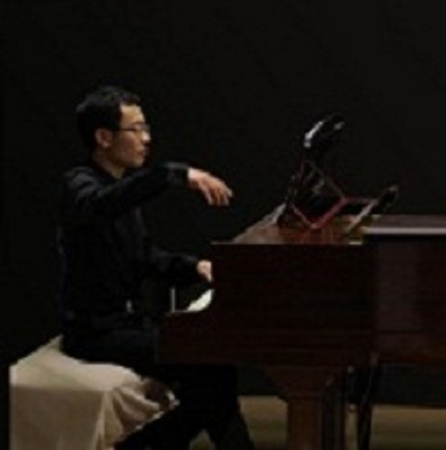
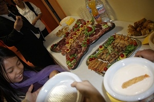

<!--
title: Nhà sáng tác Nguyễn Thiện Đạo & Hợp ca Quê Hương tại Trung Tâm Văn Hóa
author: Nguyễn Tích Kỳ
status: completed
-->

TT&VH thứ Bảy – **Tối 16/6, tại Trung tâm Văn hoá Việt Nam (CCV) ở Paris diễn ra buổi trò chuyện – hoà nhạc với chủ đề *Cuộc gặp gỡ của phương Đông và phương Tây trong âm nhạc* (La rencontre de l’orient et de l’ Occident en  musique).**

Nhạc sĩ Nguyễn Thiện Đạo giới thiệu, thuyết trình bằng tiếng Pháp, có minh hoạ bằng âm thanh, hình ảnh.

  

  

Nội dung của buổi nói chuyện này là bàn về sự song hành gặp gỡ hay không gặp gỡ, điểm khác và giống nhau của âm nhạc phương Đông và phương Tây.

Chương trình hoà nhạc nhỏ diễn ra ngay sau đó. ***Hợp ca Quê hương*** (chỉ huy: Ngân Hà) trình diễn ***Bài ca của những người nô lệ*** (Choeur des esclaves) của **A.Verdi**. Giọng nữ cao Ngọc Thanh Tâm thể hiện ***Ave Maria*** của **Schubert** và  ***Dạ cổ hoài lang*** với phần đệm guitar **Lưu Thanh Dũng** - đàn Bầu  **Minh Anh** – đàn tranh **Ngân Hà** .

  

Chương trình kết thúc bằng hợp xướng ***Trường ca sông Lô*** của nhạc sĩ **Văn Cao**, do nhà sáng tác **Nguyễn Thiện Đạo** phối âm và chỉ huy.

  

  

Đây là lần đầu tiên nhạc sĩ **Nguyễn Thiên Đạo** trò chuyện âm nhạc tại **Trung Tâm Văn Hóa (CCV)**. Nhạc sĩ có hai quốc tịch, vẫn đi – về cống hiến âm nhạc cho khán giả tại Việt Nam và Pháp.

*Thông tin của CCV & TTXVN (ảnh của HCQH)*

*18.06.2012*

