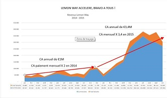

<!--
title: Markdown test
author: Phu Hiep DUONG
status: draft
-->

Bài viết này biểu diễn việc nhúng các thẻ HTML vào bài viết để có thể format được bài viết nhiều hơn so với Markdown. Nhưng khuyến cáo là không nên lạm dụng sức mạnh này..

**Disclaimer**

Các bài viết của các bạn chỉ nên là markdown thuần túy. Việc trình bày bài viết được đẹp đẽ không thuộc trách nhiệm của người viết bài mà là trách nhiệm của hệ thống format tự động.

# Căn giữa in đậm, nghiêng và paragraph

Toàn bộ trong này căn giữa hết... xuống dòng  
**In đậm**,
*In nghiêng* được căn giữa
  
Đây là 1 paragraph được căn giữa

# Căn giữa các title lớn nhé

# Tiêu đề level 1 được căn giữa
## Tiêu đề level 2 được căn giữa

# Căn giữa ảnh

# Đổi màu chữ

Dòng chữ này màu đỏ!!!  

Đổi luôn cả đoạn paragraph

-----

<h1>Nếu muốn có thể viết hoàn toàn bằng HTML</h1>

  Mở đầu paragraph... xuống dòng 
  <b>In đậm</b>   <i>in nghiêng</i>

chèn ảnh 

