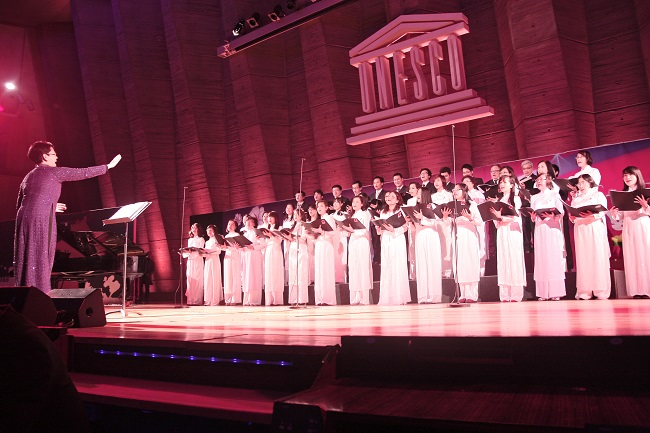
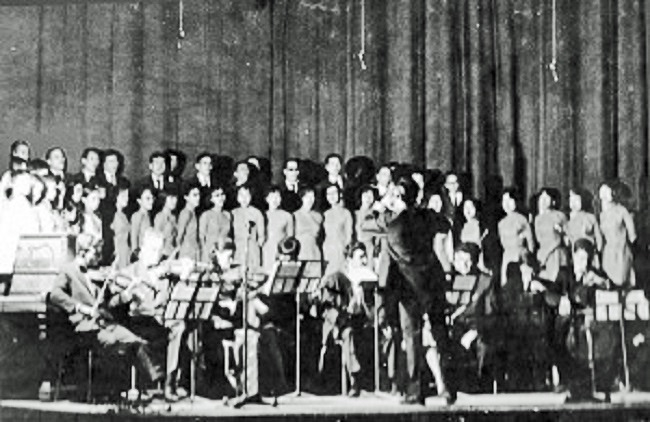

<!--
title: About our foundation
author: Tích Kỳ
-->

Founded in April 2009, the Quê Hương Ensemble (Motherland) brings together Vietnamese Diaspora members in Paris, the majority of whom are students, researchers and international civil servants. Working in partnership with professionals from Vietnam’s top academies of music in Hanoi and Ho Chi Minh City, the forty-member group currently owns in its rich repertoire both classical and contemporary chora works, which are represented mainly in Vietnamese, but also in French and English.
Through the most representative Vietnamese choral works, the Quê Hương Ensemble strives to bring a typical cultural feature of  Vietnam to an international audience. The group had in its busy 2010 schedule a range of performances at UNESCO Headquarters and the Cathedral Saint-Louis des Invalides, France. 

On another note, the Quê Hương has been known to a larger audience since its international debut at the 24th International University Music Festival of Belfort, France in May 2010. The group has also been regularly featured in the major cultural festivals of the Vietnamese community in Paris, the most popular of which is the annual artistic performance of the traditional new year – the Tết at UNESCO

The Quê Hương Ensemble in France was established as a result of the meeting of lovers of Vietnamese ‘classic’ musical tradition. By “classic” we mean musical pieces of high artistic value and cultural standard which have found their ways into the hearts of the general public and survived the test of time, socio-historical changes and the intrusion of popular culture.

Another important factor that led to the advent of the ensemble is the long-standing singing tradition of the many Vietnamese living, working and studying abroad. This tradition dates back to the days when simple, unaccompanied songs were performed by Vietnamese labourers who were forced to leave their homeland and work under the colonial regime. Their songs were inspired and guided by an immutable love for their country and its culture.

In those days, while the whole country was bracing itself up for the two sacred wars of national salvation, Vietnamese diaspora all over the world, including those in France, tried to demonstrate their patriotic love as they thought day and night about the country immersed in bombs and shells. Their patriotism and aspirations for peace and independence for their country and fellowmen found their concrete expressions in various forms of contribution, including the artistic performance that later came to be known as the “songs outvoicing bombs” movement.

Back then, whenever spring came, the Maubert-Mutualite Hall would be filled with singings from a choir of no fewer than 80 people, performing such works as “Singing praise of my Homeland” by Hồ Bắc, “The Waves of Cửa Tùng” by Doãn Nho or “Songs at the Frontier” by Tô Hải, and “The Lo River’s Epic” by Văn Cao.

They sang with all their hearts to provide spiritual support to their fellow countrymen back home. Their songs were filled with an ardent love for their country and a firm belief in the final victory and longevity of their nation.

Decades have passed since the wars ended, and what is left in the people of today and tomorrow are only memories of those hard but glorious days of our motherland. Those memories, however, form part of the national character and culture moulded throughout history. And as part of national culture, they have a ripple effect that touches upon the soul of every Vietnamese.

The undeniable artistic values of the revolutionary songs have become the pivotal guiding principle for the Ensemble. Those songs have become a school on their own merits as they were written by and for the people. They voiced the aspirations of the people and nation throughout the course of a tragic yet heroic period of time in the national history. That kind of music is so powerful that it could drown the sound of the bombs while remaining no less romantic and lyrical. It was arguably thanks to these songs that the whole nation emerged as final victors, and hence they have become part and parcel of the Vietnamese identities.

It is the values of these revolutionary songs that bring together veteran members of the Vietnamese diasporic community, including students, researchers and international civil servants living and working in France who share not only a love for the country but also a passion for choral music. They have joined hands and worked shoulder by shoulder to inherit, preserve and propagate a unique tradition of the Vietnamese community in France in particular and of Vietnam in general.
