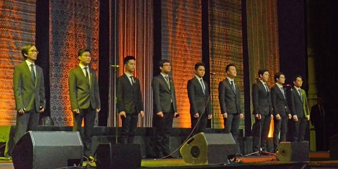
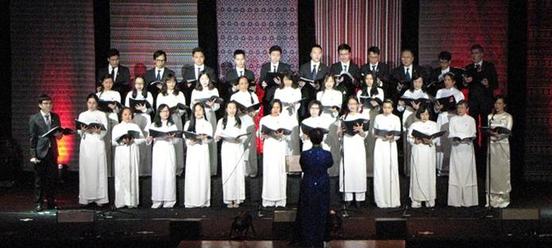
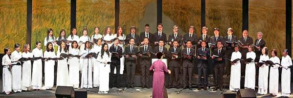
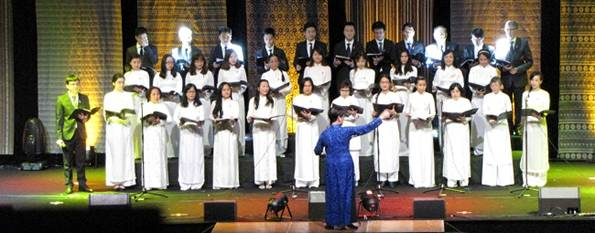

<!--
title: Thư gửi tới các thành viên Hợp ca Quê Hương
author: Nguyễn Tích Kỳ
status: completed
-->
  

Thân gửi đến các em,

Trước hết chú trân trọng khen toàn bộ các em đã thành công. 
Trước phản ánh nồng nhiệt của khán thính giả và quan khách đến dự chương trình Tết Bính Thân do Hội Người Việt Nam tại Pháp tổ chức tại Pavillon Baltard, họ nhận định tốt về chương trình và ca tụng không tiếc lời hai tiết mục đặc sắc của HCQH: Tốp ca Nam và Hợp xướng. Cũng như phản ánh chung của những em về ăn Tết nơi quê nhà và những em đang làm việc tại VN. Sau khi xem chương trình "HCQH tại Baltar 2016", họ rất xúc động và hãnh diện đã từng đứng trong hàng ngũ HCQH.

Chúng ta đã giới thiệu trước cộng đồng trong ngày Tết cổ truyền một chương trình chất lượng với thời gian chuẩn bị tương đối ngắn. Song song đó ta còn phải tập luyện một chương trình phức tạp hơn cho lần trình diễn sắp tới với Ensemble polyphonique de Choisy tại Paris. Chúng ta có quyền hài lòng, không với tinh thần tự mãn bừa bãi, nhưng với tinh thần không ngừng cải thiện. 

Nhận xét riêng của chú về Tốp ca.  

  

*Tốp ca Nam HCQH (Ảnh Hoàng)*

Với bài "Lướt sóng ra khơi" của Thế Dương, chú xin trân trọng khen Tốp ca Nam rất ấn tượng. Từ phát âm, phối giọng, cho đến đội hình, người xem lĩnh hội ngay được sự chuyển tải ý nghĩa của bài hát và đặc điểm của từng cá nhân trong Tốp ca, đặc biệt là Duy Tâm tuy không được đào tạo trong ngành Lý-Sáng-Chỉ nhưng em đã đem lại một không gian phối âm rất ấn tượng cho bài "Lướt sóng ra khơi".  

Em Hiển đã đem lại cho chú một ngạc nhiên rất đáng kể. Gia nhập HCQH ngày trước ngày sau đã xung phong vào đội Tốp ca (chú cười thầm, bụng bảo dạ thằng này háu đá, mắt to hơn bụng rồi). Không đâu nhé, lần tập sau em đã thuộc bài gần hết, tuy hát thì còn hơi chếnh choáng một chút. Em bèn âm thầm xin lại nhà em Quân tập "nước rút" với sự hướng dẫn của Quân. Đất Hà Đông không chỉ làm lụa giỏi, mà còn có những em nhiều nghị lực thế đấy.  

Các giọng Ténor còn lại: Đạt, Tuấn, Việt, Đức Dũng, Hoàng Anh, Hiệp mỗi em đều nắm vững phần mình, kể cả Đức Dũng "mới toanh", Tất cả đều bổng trầm với tiếng đàn ngày càng ngọt ngào điêu luyện của Duy Tâm, rất ấn tượng. Rất tiếc em Quân vắng mặt, phải về VN, vì chuyện gia đình.  

Hưng và Cảnh đã đem lại tiếng rền vang của Bass khi tàu vượt sóng ra khơi. Bè Bass là một Bè rất cần thiết cho chiều sâu và tiếng vang rền của câu hát. Đó là điều lo ngại không nhỏ của HCQH. Tuy vậy, bản tốp ca lần này không gặp khó khăn với sự cố gắng của Hưng và Cảnh. Vì lực lượng Ténor hùng hậu rất rõ nét, thiếu Bass là nó vênh ngay. Trong bè Bass có em chỉ có thể "tập tại gia" với bài Cô gửi đến, điều này cũng có thể miễn cưỡng chấp nhận. Em này đã nỗ lực học và có mặt trong vài-ba lần tập cuối. Với tinh thần trách nhiệm tự tập thật sự, em đã chứng minh ngạn ngữ "vouloir c'est pouvoir" và đã thảnh công. Em đã có mặt trong những lần lắp ráp toàn bộ, rất hữu ích và đã trấn an đồng đội. Chú chúc mừng sự quyết tâm của em. Nhưng chú vẫn nghĩ rằng nếu em có khả năng sắp đặt như vậy, tập thêm được vài lần nữa sẽ không dư thừa.  

Rất tiếc, Tốp ca trình diễn trong điều kiện không có loa "retour sur scène" điều tối kỵ của nghệ sỹ, vì không nghe được mình đang hát gì. Tuy nhiên các em đã kết thúc bài "Lướt sóng ra khơi" thật là hiên ngang, oai hùng như một lời tuyên thệ của người chiến sỹ trước khi xung kích. Đứng sau cánh gà chú phải cắn môi để dấu xúc động. Cảm ơn các em đã thành công. 
  
Bước sang bài "Đất nước bên bờ sóng" cuả **Thái văn Hoa**. Khởi đầu không phải là một tác phẩm dành riêng cho Hợp xướng, nhưng HCQH đã nhờ anh Lê Hồng Phúc đặc biệt phối thành Hợp xướng cho riêng HCQH. Các em nên biết, tất cả hoạt động của HCQH đều bắt nguồn từ chữ TÂM. 

  

*Hợp ca Quê Hương Tết Bính Thân 2016 (Ảnh Hoàng)*  

Đây là lần thứ nhất "Đất nước bên bờ sóng" được trình diễn với hình thức Hợp xướng. Tại quê nhà hầu như ai ai cũng biết đến bài này, trình diễn đơn ca là chủ yếu. Nghệ sỹ Bích Toàn, một ca sỹ đã từng đưa bài hát này vào tâm hồn các anh "Bộ đội Cụ Hồ" ngày ấy. Do vậy Cô chú rất phập phồng lo ngại (chồng thêm một công việc khá khó với bài Magnificat của Bach và "Linh Giác" tác phẩm cuối đời của Nguyễn Thiên Đạo). Hơn lúc nào, sự thiếu vắng không đi tập là thêm một lo ngại đáng kể. 

Chú xin trân trọng khen bè Sop. Hôm nay, lên cao rất đúng và nhịp rất chuẩn. Chỉ tiếc một điều còn có những em vắng mặt do "Tôi không đi tập đều vì lý do abc... vậy ngày trình diễn Tết tôi sẽ ở nhà". Tinh thần "phúc cùng hưởng họa cùng chia" để đâu rồi? Không lên hát vì lý do cá nhân nhưng còn lại bao nhiêu viêc cần sư có mặt như ủng hộ đồng đội, chụp hình, giữ hộ đồ đạc có giá trị của đồng đội, bản nhạc cho Tốp ca, hóa trang cho các em trai, thiếu gì công việc có ích lợi chung.

Rất đáng được khích lệ những em Sop đèo bòng chồng con, vẫn tổ chức đến hội trường, tuy tập luyện trong năm chưa phải là thành phần đều đặn. Có những em đã thuyết phục "người chồng nội trợ ngẫu nhiên" mỗi chiều thứ bày giữ con để đi tập Hợp ca. Rất cảm phục các em đã duy trì tinh thần này, điều mà không phải ai cũng làm được. Vả lại khái niệm của đa số là, hát Hợp xướng là có thể "hát dựa" "hát nhép". Rất có thể hành sự được như vậy. Nhưng muốn thực hiện được điều này thì cần thiết tối thiểu là phải biết nghe đồng đội đứng hát cạnh bên, và sự "ra vào" câu hát của bản thân không thô bạo. (Bàn chuyện thì thấy dễ, nhưng muốn thực hiện được những điều này cũng cần sự có mặt tối thiểu trong các buổi tập để nắm bắt và cập nhật tối thiểu kỹ thuật hát bè)

Em Hùng "mới toanh mới ra lò" nhập Bè Bass khi nghe em luyện tập chú khá lo. Em cũng đã chứng minh "vouloir c'est pouvoir". Khi trình diễn em đứng bên tôi, tôi vừa hát, vừa tập trung nghe em hát, em hát rất sáng bài, nắm vững bè, tuy suốt buổi mắt em không rời bài hát trên tay. Hy vọng em sẽ cải thiện được tật nho nhỏ này. Chúc mừng em đã vượt khó khăn và đã thành công những bước đầu.

Thêm một ngạc nhiên khi nghe em Pierre Jayat một bạn Pháp 100% phát âm càng ngày càng chuẩn mực, chỉ còn vài từ chưa rõ nét nhưng trên đà này em có triển vọng còn đi xa. Và Catherine Jayat, người vợ của Pierre, em có 1/3 nguồn máu Việt, hiện đang sinh hoạt trong Bè Alto họ đã có nhiều tiến bộ trông thấy. Hai vợ chồng đã tiến bộ rất nhiều trên lãnh vực nghe, đọc và phát âm. Sự tử tế và hòa nhập với đồng đội thì vợ chồng Jayat đã có sẵn không cần phải học ai. Chúc 2 em phát huy khả năng và cải thiện phát âm nhiều hơn nữa. 

Cũng có một em gái mang tên Caroline Adler 100% người Tây ban Nha. Vì một tình cờ em đã đến với HCQH em sinh hoạt trong bè Sop. Một quý đã đi qua với sự trầm bổng của cái rào ngôn ngữ, nay em đã đọc được bài hát và quyết tâm học tiêng Việt, phải nói là khi em gia nhập HCQH em không biết tí gì, nhưng với đam mê, em đã hát rất tốt. Một ngày nào đó HCQH sẽ sang quê hương của em giới thiệu văn hóa Việt nhé.

Nói đến đôi lứa trong dàn Hợp ca thì không thể nào quên đôi bạn Đức Dũng - Diệp Minh mới gia nhập gia đình Hợp ca chưa đầy một quý. Em DŨNG trong Bè Ténor và em MINH Bè Sop, hơn nữa Đức Dũng còn có mặt trong Tốp ca Nam. Chúc mừng hai em đã thích nghi không vấp váp và các em hát rất chuẩn. Chú thiết nghĩ dàn Tốp ca nữ sẽ sớm được hình thành.

Em Tuấn lĩnh xướng rất tốt. Như vậy là HCQH có 2 em Nam diễn đơn rồi. Hy vọng diễn đơn Nam không dừng lại ở con số 2.

Ghé mắt nhìn phía kỹ thuật. Tiếc là màn phông, và cảnh vẫn chỉ có một ý tưởng như năm ngoái mà còn dở hơn năm ngoái, trang trí không bắt mắt, bắt ánh sáng và thiếu sáng tạo. Người chỉ đạo ánh sáng thì hoàn toàn lạc hậu không nắm bắt tinh thần sân khấu, nơi cần có ánh sáng thì không có, nơi không cần thì tràn ngập (hình ảnh ĐÊM PAVILLON BALTARD Cô đã gửi đến các em, chứng minh điều này).  

**Có thể so sánh màn phông và ánh sáng của năm 2015 và 2016** 
 

*Tết Ất Mùi 2015 tại Baltard . 40 thành viên. Hình tượng xếp Nam ở giữa. Ánh sáng khả dĩ rất ngắn 2 bên.*

  

*Tết Bính thân 2016 tại Baltard 34 thành viên. Màn phông buồn hơn năm 2015. Ánh sáng quá tệ nơi cần có ánh sáng thì không có, nơi không cần thì tràn ngập (điển hình 4 người đứng hàng cuối, bị chiếu sáng trắng). Năm nay nữ cân đối, nam vắng 7 người.*

Tò mò, chú đếm toàn bộ máy chiếu sáng (projecteur), từ máy chiếu thẳng cho đến máy chiếu đa năng có khả năng màu và xoay chuyển hướng, có khoảng chừng 70 cái projecteurs đủ loại được móc trên trần và 2 bên sườn cánh gà chưa kể 3-4 máy rọi sáng cho cá nhân (projecteur d'acteur và projecteur médaillon présentateur). 
Nói chung máy móc ánh sáng được trang thiết bị đầy đủ và bàn điều hành được gắn ở không gian cuối phòng, chủ yếu là để có được cái nhìn tổng quát như khán giả, chưa kể là khi phòng đầy khán giả nhiệt độ sẽ lên cao ảnh hưởng đến sự trong suốt của ánh sáng và âm thanh. (Ngày trước, trong nhiều năm Chú đã từng làm sân khấu và và chung việc cùng giới trẻ, thời điểm đó họ cũng "chỉ có tấm lòng" không hơn không kém).    
  

Viết nhiều, hy vọng các em đọc không chán. Không có sự thật nào dễ tiêu hóa cả, không làm thì sẽ không bao giờ có sơ suất. Nhưng sơ suất kéo dài theo năm tháng là vấn đề.  

21.02.2016

Chú TK

***Vào đây tham khảo thêm - Les autres articles***   
