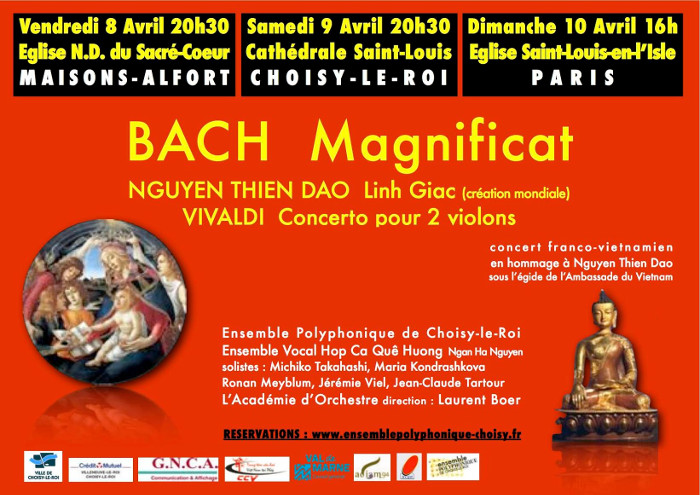

<!--
title: Concerts Bach - Dao- Vivaldi
author: Nguyễn Ngân Hà
status: completed
-->

  

*Hợp Ca Quê Hương* se joint à *l’Ensemble Polyphonique de Choisy le Roi* pour trois concerts: le **Magnificat** de **BACH** associé à la création du regretté **NGUYEN THIEN DAO**, **Linh Giac** -  Jubilation vocalisante et contemplation sereine - Universalité de la musique, une belle découverte!

##### **Programme**
- BACH : Magnificat  
- VIVALDI : Concerto pour 2 violons  
- NGUYEN THIEN DAO : Linh Giac (en création mondiale)  

##### **Les concerts**
- Vendredi 8 Avril 2016 à 20h.30: Eglise N.D. du Sacré-Coeur, Maisons-Alfort, 41 Rue Cécile (Métro 8, station Maisons-Alfort-Stade)

- Samedi 9 Avril 2016 à 20h.30: Cathédrale Saint-Louis, Choisy-le-Roi, Place de l'Eglise (RER C Choisy-le-Roi)

- Dimanche 10 Avril 2016 à 16h.: Eglise Saint-Louis en l'Isle, Paris

##### **Renseignements et réservations**
- [Sur le site](http://ensemblepolyphonique-choisy.fr) 
- [Sur la page facebook](https://www.facebook.com/profile.php?id=100009063439250)

