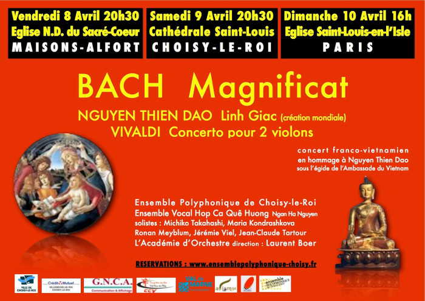

<!--
title: Hợp ca Quê Hương tham gia biểu diễn trong buổi hòa nhạc Bach - Nguyễn Thiện Đạo - Vivaldi
author: Nguyễn Ngân Hà
status: completed
-->

  

*Hợp Ca Quê Hương* sẽ tham gia biểu diễn cùng với *Dàn hợp xướng Choisy le Roi* trong ba buổi hòa nhạc về Nhạc phẩm **Magnificat** của **BACH**, kết hợp với tác phẩm của cố nhạc sĩ **NGUYỄN THIỆN ĐẠO**, **Linh Giác**. Sự kết hợp này là một minh chứng cho tính không biên giới của âm nhạc. Buổi hòa nhạc sẽ mang tới cho các bạn những giai điệu thanh tịnh - một trải nghiệm tuyệt vời!

##### **Chương trình buổi hòa nhạc**
- BACH : Magnificat  
- VIVALDI : Bản Concerto dành cho 2 violon
- NGUYỄN THIỆN ĐẠO : Linh Giác (lần đầu tiên ra mắt)  

##### **Thời gian, địa điểm**
- Thứ 6 (08/04/2016) - 20h.30 - Eglise N.D. du Sacré-Coeur, Maisons-Alfort, 41 Rue Cécile (Métro 8, station Maisons-Alfort-Stade)

- Thứ 7 (09/04/2016) - 20h.30 - Cathédrale Saint-Louis, Choisy-le-Roi, Place de l'Eglise (RER C Choisy-le-Roi)

- Chủ nhật (10/04/2016) - 16h - Eglise Saint-Louis en l'Isle, Paris

***Vào đây tham khảo thêm - Les autres articles***  

* [HCQH Tai TTVH](/#post/2015-06-18%20%20HCQH%20Tai%20TTVH)

* [2016-04-26 FinanceConcertsVN](/#post/2016-04-26%20FinanceConcertsVN)  