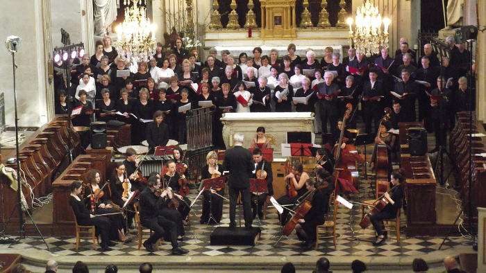

<!--
title: Dự án âm nhạc gặp gỡ văn hóa Đông-Tây
author: Ngan Ha Nguyen
status: completed
-->

  

Tác phẩm Linh Giác đã được trình diễn rất thành công tháng tư 2016 vừa qua tại Choisy le Roi và Paris. Hợp Ca Quê Hương và Ensemble Polyphonique de Choisy le Roi sẽ đưa tác phẩm này về giới thiệu ở Việt Nam, đất nước mà cố nhạc sĩ Nguyễn Thiện Đạo đã gắn bó suốt đời mình. 

Chúng tôi sẽ trình diễn tác phẩm cuối cùng này của cố nhạc sĩ cùng với Magnificat của Bach. Theo dự kiến, hai buổi hòa nhạc sẽ được tổ chức ở Hà Nội và Thành phố Hồ Chí Minh. Chương trình này là một dự án tuyệt đẹp thể hiện sự hợp tác hữu nghị Pháp- Việt và nói lên được ý nghĩa sâu sắc của sự gặp gỡ văn hóa Đông-Tây. 

Phần lớn kinh phí đã được tài trợ nhưng chúng tôi cũng cần sự giúp đỡ của các bạn để hoàn tất việc đi lại và ăn ở của 60 ca sĩ.

Dự án này đã được giới thiệu trên trang web [KissKissBankBank] *

(http://www.kisskissbankbank.com/une-musique-pour-unir-creation-musicale-au-vietnam?ref=category)

***Vào đây tham khảo thêm - Les autres articles*** 