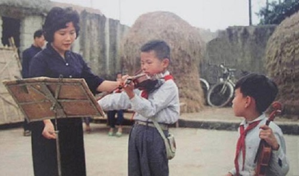

<!--
title: ÂM NHẠC VỚI TUỔI TRẺ HIỆN NAY
author: TichKy Nguyen
status: completed 
-->

       

Âm nhạc từ lâu là một phần không thể thiếu trong đời sống tinh thần của con người. Đối với giới trẻ hiện nay, âm nhạc có vị trí vô cùng quan trọng, góp phần cân bằng cuộc sống và cũng là một yếu tố giúp định hướng cách nhìn về cái đẹp chuẩn mực. Tuy nhiên, âm nhạc Việt Nam đối với các bạn trẻ hiện nay đang có nhiều vấn đề đáng bàn. BBT xin giới thiệu đến các bạn những trăn trở của nhạc sỹ Doãn Nho về chủ đề này.

----
Tôi tin rằng không chỉ thế hệ nhạc sĩ đã qua mà cả thế hệ nhạc sĩ hôm nay và mai sau đều khẳng định mạnh mẽ âm nhạc là món ăn tinh thần không thể thiếu, đồng thời là vũ khí bất ly thân của tuổi trẻ trong dựng nước và giữ nước. Tuy nhiên trong thực tế luôn luôn có sự đan xen cái tiêu cực bên cái tích cực, và vì vậy không có cách nào khác là phải vừa chống vừa xây, mà xây phải là chính.   

Thật may mắn tôi được xem chương trình ca nhạc với tiêu đề “Hướng về Hà Nội” tối 15/11/2012 của Đài truyền hình thành phố HCM. Trong chương trình toàn những bài hát quen thuộc như “ Em ơi Hà Nội phố” của Phú Quang-thơ Phan Vũ, “Mong về Hà Nội” của Dương Thụ, “Hà Nội và tôi” của Lê Vinh…. Giai điệu đẹp, sang trọng và sâu lắng của những ca khúc về Hà Nội như một đối trọng tự nhiên với các ca khúc ồn ào nhộn nhịp trẻ trung với yếu tố tiết tấu nổi bật trong đời sống âm nhạc thường nhật của thành phố HCM. Hai phong cách không phủ định nhau mà bổ sung cho nhau đem lại mỹ cảm phong phú cho tâm hồn người nghe… Tôi tin sắp tới chương trình giới thiệu những tình khúc của nhạc sĩ Văn Cao và nhạc sĩ Trịnh Công Sơn cũng sẽ đem lại hiệu quả như vậy.  

Trong số các chương trình ca nhạc có mặt hàng tuần trên màn ảnh nhỏ, có lẽ hoành tráng nhất, thời thượng nhất là chương trình Giọng hát Việt (The Voice of Viet Nam). Chỉ tiếc chương trình chưa đi dúng hướng khiến khán thính giả nghĩ rằng đây là chương trình sùng ngoại, đáng lý phải theo hướng Việt hóa những tinh hoa của nền văn hóa âm nhạc nước ngoài thì ngược lại, hình như muốn chúng ta phải “hóa thân” theo thẩm mỹ của nước ngoài! Nếu đúng như vậy thì đây thật sự là một hoang tưởng! Chúng ta hiện đã có một kho tàng đồ sộ những bài hát hay thuộc hầu hết các dòng trong nhạc nhẹ-nhạc trẻ, vậy tại sao không sử dụng? Chương trình mang tên Giọng hát Việt nhưng sao chẳng thấy hồn Việt đâu cả! Hi vọng rằng thời gian tới chương trình này sẽ được chỉnh lại đúng hướng góp phần làm đẹp thêm, đậm đà thêm bản sắc Việt của chúng ta.  

Có lẽ không cần điểm lại những mốc son trong tiến trình mấy ngàn năm lịch sử của dân tộc, mà chỉ cần nhìn lại từ Cách mạng tháng 8/1945 tới nay, trong đó đã có gần 40 năm chúng ta sống trong hòa bình thống nhất đất nước, rõ ràng tuổi trẻ luôn luôn đứng ở mũi nhọn của sự phát triển, của mọi thắng lợi mang ý nghĩa lịch sử. Và như một tất yếu, âm nhạc chỉ làm nên vai trò của mình khi sánh vai với tuổi trẻ trong suốt quá trình này. Chúng ta đang sống trong thời bình và trong xu thế hội nhập thế giới, dĩ nhiên có những thuận lợi và những phức tạp của nó. Điểm nổi bật hiện nay là nhu cầu giải trí quá lớn, để thỏa mãn phải luôn luôn lạ, mà lạ chưa hẳn đã là cái mới. Do vậy để sáng tác thành công, tác giả không chỉ vững tay nghề mà trên hết trước hết phải có cái TÂM và cái HỒN chân thật. Trong tạp chí Âm nhạc của Hội NSVN số 25 năm 2012, qua bài “Nhạc tặc” tàn phá nhạc Việt, nhà phê bình Nguyễn Bách đã chỉ đích danh những tên tuổi cùng những thủ đoạn sao chép nhạc nước ngoài, thậm chí bê nguyên xi cả bài khiến nhà phê bình phải dùng cụm từ “cướp cả chì lẫn chài”! Chúng ta rất cần những bài phê bình thẳng thắn như thế, người viết dám đi vào cụ thể, vạch lá tìm sâu và dám chịu trách nhiệm.  

Muốn bám sát tuổi trẻ để viết, thật không dễ vì tuổi trẻ ở thời nào cũng vậy, rất hiếu động. Báo Nhân Dân số ra ngày 8/12/2012, trong mục “Văn hóa và phát triển” có bài “Phượt” và trào lưu sống của lớp trẻ với chú thích: “Phượt”là một dạng du lịch tự túc tiết kiệm, hay “du lịch bụi” được giớ trẻ đam mê bởi sự tự khẳng định bản thân, vượt qua thủ thách, kết nối tình bạn và khám phá thiên nhiên…..Tôi nghĩ có thể từ “Phượt”sẽ nảy sinh những bài “Du lịch ca” mới mẻ, sống động, trẻ trung và hấp dẫn, có khả năng phổ biến sâu rộng không chỉ lớp trẻ mà cả cộng đồng hôm nay!  

Vấn đề cuối cùng cũng là vấn đề muôn thuở: sự liên kết giữa sáng tác, lý luận phê bình và nhà đài. Ấm nhạc mà không vang lên và vang xa thì coi như vẫn là số không. Gần đây đã có lúc vang lên những bài ca về biển đảo, những bài ca gợi lên và thức tỉnh tính công dân nhưng rồi nhanh chóng rơi vào quên lãng, chưa kể rất nhiều sáng tác mới ở ngay Hội Âm nhạc HN, trong đó không ít những bài có chất lượng nhưng với nhà đài Hà Nội thì hình như đó chỉ là những sản phẩm xa lạ, nằm ngoài nhu cầu của nhà đài!Rất mong cảnh bi hài này sớm được hạ màn để trước hết tuổi trẻ thủ đô có nhiều bài hát hay cùng đồng hành trong sự nghiệp xây dựng và bảo vệ Tổ quốc của chúng ta.  

Nhà soạn nhạc Doãn Nho

(nguồn hoinhacsy.org )

***Tham khảo thêm - Les autres articles***
