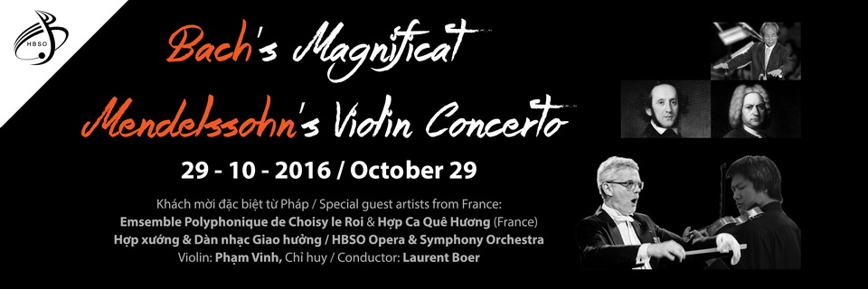

<!--
title: CHƯƠNG TRÌNH HÒA NHẠC ĐẶC SẮC TẠI TP HỒ CHÍ MINH
author: Nguyễn Hiển
status: completed
-->

Các bạn thân mến,

Thứ 7 ngày 29/10/2016, Hợp Ca Quê Hương kết hợp cùng dàn hợp xướng Choisy Le Roi và dàn nhạc giao hưởng của nhà hát giao hưởng nhạc vũ kịch thành phố Hồ Chí Minh trong một buổi hòa nhạc đặc sắc tại Nhà hát thành phố, 7 Công Trường Lam Sơn, Q.1, TP HCM. Chương trình hứa hẹn sẽ mang đến một không gian âm nhạc cổ điển đặc sắc với tác phẩm kinh điển Magnificat của nhà soạn nhạc vĩ đại người Đức J.S Bach và tác phẩm mang tên "Linh Giác", tác phẩm cuối cùng của nhạc sĩ nổi tiếng người Việt, Nguyễn Thiện Đạo.

**[Xem chi tiết chương trình](http://www.hbso.org.vn/BrowseArticle.aspx?CatID=10&ID=210)**

