<!--
title: Loi tri an 
author: TichKy Nguyen
status: completed 
-->
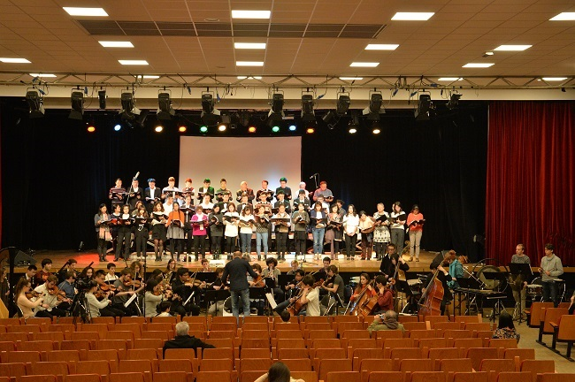

Các em thân mến,

Đối với tập thể của chúng ta HCQH đã tiến thêm một bước rất rõ nét.
 
Đã thực hiện được ý niệm ban đầu, đó là duy trì tình yêu Quê hương đất nước trong mỗi chúng ta, đề cao tinh thần cộng đồng và phổ biến rộng rãi kho tàng nhạc kinh điển của Việt Nam đến bạn bè quốc tế. 
Tự hào của một dân tộc, truyền thống chống xâm lăng.  
Từng bước HCQH đã đi đến hôm nay.
   
Và hôm nay 03.12.2016 tại Espace Reuilly. 75012 Paris chỉ là một nét gạch nối giữa quá khứ và tương lai.

HCQH chân thành cảm ơn những bạn gần xa, nhữn em cũ mới, những em "chỉ đến giúp được một lần" đã không ngần ngại "gác sang bên" một buổi chiều thứ bảy "hẹn hò" đã đến cùng với HCQH "hồi tưởng" những chiếc "mũ tai mèo" thân thương của một thời hoa lửa, những biển đảo ruột thịt hôm nay đang bị phương Bắc dòm ngó, đe dọa chủ quyền. 
Xin chân thành cảm ơn các bạn, các em và những người "chồng ngoại" của các em đã đem đến cho HCQH những tình cảm vô giá. 
Không thể nào quên sự ủng hộ của Đại Sứ Quán Việt Nam / Trung tâm văn hóa Việt Nam / và những đoàn thể. 
Khi nhắc đến đoàn thể, chắc không ai quên sự đóng góp của các em nhi đồng đến từ Câu lạc bộ Âu Việt đã chia sẻ với HCQH bài Hồi Tưởng của Nhạc sỹ Hoàng Vân. 

Cảm ơn các em và phụ huynh của các em. 

Đứng trước nhu cầu cần thiết, và định hướng rất rõ ràng cụ thể của những em trách nhiệm các "tổ chuyên", 99% các em có mặt tại Espace Reuilly đã chứng minh tinh thần "trách nhiệm & đoàn kết", từ việc di chuyển những tấm bục để Hợp xướng đứng có chiều cao, vị trí của mỗi em được sắp xếp theo bè và rất thứ tự trong buổi trình làng CD đầu tay này, mỗi bục năng ngót 100kl phải cần 4 em có lực khuân vác, vật lộn với ốc-vít trong im lặng có thể... 
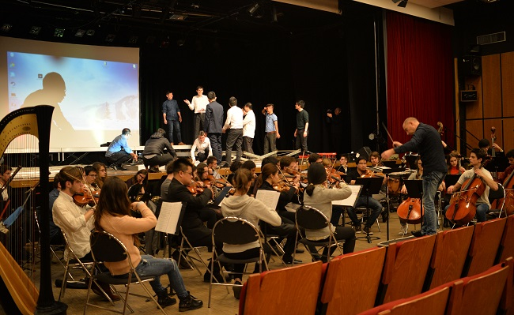
vì kề bên có Dàn Nhạc Giao Hưởng mới đến từ Rouen, xe ka của anh em nhạc công bị ùn tắc giao thông trên xa lộ, đến trễ, có ảnh hưởng ít nhiều đến phần duyệt chương trình (filage). 
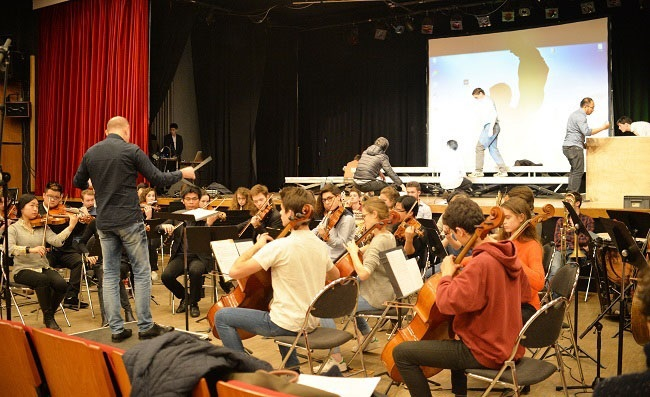  
Bên cánh gà trên sân khấu 2 em đang điều chỉnh máy vi tính để chuyển tải cho chúng ta hình ảnh và những gương mặt thân quen của những năm sinh hoạt gần đây. 

Trong một góc ngoài sảnh lớn, 2 em dẫn chương trình một Nam một Nữ đến từ 2 tỉnh khá xa Paris tranh thủ bàn việc với nhau, tập bài giới thiệu.
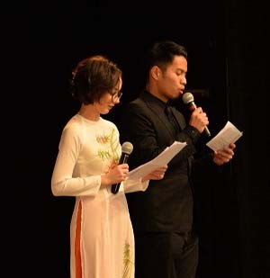 
Em trai có tâm sự với tôi "- Hôm nay đông quá chú ạ, khi nghe nói có Đại sứ và nhiều quan khách dự. Cháu "run" quá chú ơi". 
Hầu như toàn bộ các em đều có chung một tâm tư, sự thành công của buổi trình diễn này.  
Các em ơi, chú rất hiểu và chia sẻ tâm trạng.
  
Nhìn các em tổ Trang trí đang lựa chọn và sắp xếp hình ảnh, dẫn giải tỉ mỉ, vị trí và quá trình lịch sử, đây Trường sa kia Hoàng sa, không gian triển lãm được kéo dài với dấu ấn thời gian đã ghi lại từng bước tiến của Hợp ca Quê Hương, những khuôn mặt mới cũ chan hòa và bình dị.
 
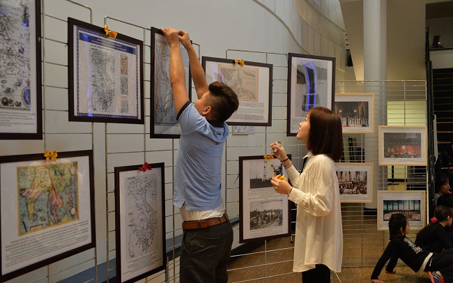  
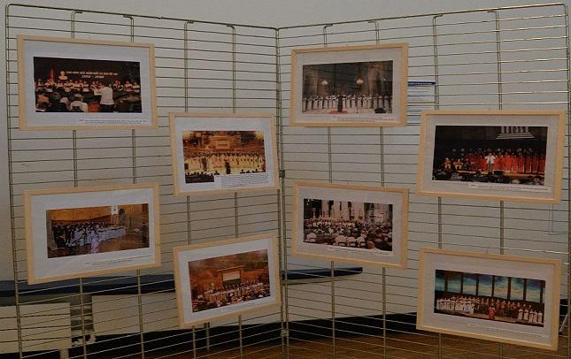

Tôi cảm thấy ấm lòng, các em rất trẻ trung và cũng rất trách nhiệm trong công việc.  Đây rồi, những người cầm đuốc tiếp lửa trong tương lai.

Trong khi đó, vị khách mời của chúng ta, em Ninh Đức Hoàng Long đến từ Hungarie, trước đó chưa được tập lần nào với dàn nhạc, có nhiều nét lo lắng hiện rõ. Em hát rất hay và giọng rất đẹp, rất "dễ gần" điều mà rất ít "Sao" làm được.
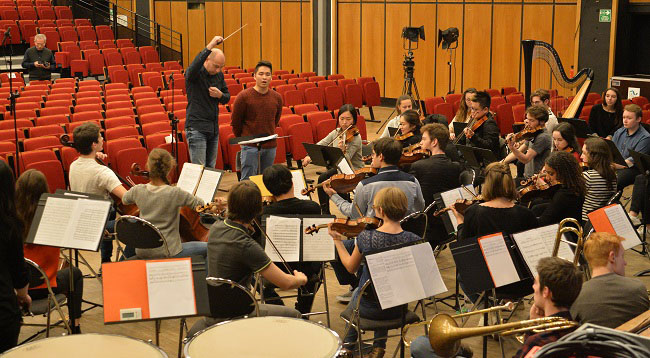  
Tôi "ấp ủ" nhiều đề án hợp tác trong tương lai với Hoàng Long đấy nhé. 
Cảm ơn Pierre và Catherine rất dễ thương và rất hiếu khách.

Dàn âm thanh "cây nhà lá vườn" chưa có kinh nghiệm điều chỉnh dung hòa âm lượng giữa 50 nhạc công và 4 bè của dàn Hợp xướng (50 người hát). 
Đồng thời phải phối hợp giữa hệ sẵn có của sân khấu và hệ của một em mang đến "giúp một tay".  
Các em âm thanh đã "tùy cơm gắp mắm" đem lại cho người nghe một kết quả trên mong đợi, thật tuyệt vời. 

Cảm ơn các em.

Một lần làm CD là một lần khó, tại sao không "trên đà" nhỉ ? anh em HCQH suy nghĩ đơn giản như vậy và xin "bật mí". Vâng, không những trình lảng CD mà "trên đà" HCQH cũng nhờ kỹ sư âm thanh Christophe Mazzela ghi âm và ghi hình cho 1 DVD tương lai, sẽ hoàn thành cho TếT năm nay.
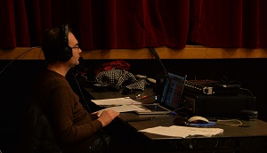 
Cảm ơn Christophe Mazzela và ê kíp . 

Các em tiếp tân rất "tháo vác" không kém phần lung linh với chiếc áo dài cổ truyền, trên môi luôn có một nụ cười thân thiện. 
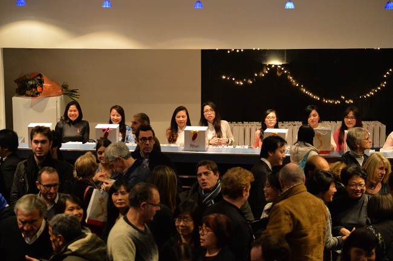   

Các tổ chuyên trách đã hoàn thành công việc khớp với thời gian dự trù. 

Với "tính cách chữ cháy". Em Trách Nhiệm Trưởng của sân khấu "chỉ được mời tham dự đề án" vài ba hôm trước ngày trình diễn. Em hỏi mọi chi tiết rất kỹ và rất "chuyên", trước khi đi vào công việc. 
Bàn giao trách nhiệm "giữa gềnh" như vậy là một điều tối kỵ và bất đắc dĩ. Tôi thở phào, vì nghề nghiệp của em, không liên quan gì đến nghệ thuật sân khấu. Em đang dạy tại Ecole du Louvre về Nghệ-thuật-Châu-Á và có trách nhiệm với vài Bảo Tàng khác tại Paris. 
Viết đến đây, tôi liên tưởng đến "tổ điều hành việc giữ chỗ qua mạng internet và tổ chức giây chuyền nhân sự tiếp tân". Ngay từ giờ phút được bàn giao trách nhiệm cho đến lúc sân khấu lên màn, các em đã đối diện nhiều thử thách bất ngờ thuộc về số lượng và thời gian. Cảm ơn sự tận tụy của các em.

Hôm nay đường phố, giao thông rất "kẹt xe" quán cơm đã giao 100 phần ăn trễ ngót 1g .
 
Hơn nữa thêm một bất ngờ do một nhóm "tàn quân lưu vong " biểu tình chống Việt Nam, chúng tìm đủ mọi cách phá rối với những lời nói thô bạo, xúc phạm và xuyên tạc, nhằm gây áp lực ngăn cản khách đi xem văn nghệ. 
HCQH không chủ trương đáp trả bạo lực này. 
Do vậy các em trấn an bà con Việt Nam và ngoại quốc đi thưởng thức văn nghệ bằng hình thức giữ bình tĩnh.Việc an ninh là thuộc về cảnh sát Pháp.

Mở màn đúng giờ. Bằng vidéo clip giới thiệu danh lam Việt Nam. 
Chương trình được chấm phá bằng những nét vidéo clip rất thời sự, linh động. Cảm ơn tổ vidéo clip đã động não hình thành việc này.
  
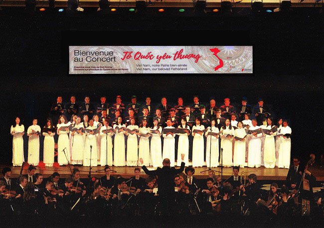 
Hợp xướng xuất hiện, cân đối, không gồ ghề.  
Sự sắp sếp đội hình 3 hàng rất chỉnh tề, nếu có thêm một bục cho hàng giữa thì "tuyệt vời". "Cái khó bó cái khôn" là thế đấy, tôi muốn đề cập khía cạnh kinh tài. 
Thành thật xin lỗi 5 em Sop và Alto đứng ở 2 đầu hàng 2 bị thiếu 1 bục.
Nhưng không hề ảnh hưởng đến chất lượng của toàn bộ Sop & Alto. 
Các em đã "vuốt" những điểm nhấn cao rất tinh tế. Cảm ơn các em.  
Tôi rất trân trọng tinh thần tập thể vì sự hoàn thiện công việc, đặc biệt nhân cách đối sử của Bè Ténor . Các em đã trưởng thành và HCQH không quên sự cố gắng vượt khó cuả Bè Bass.

Nói chung các em HCQH rất xứng đáng, rất tiêu biểu cho sự thành công chương trình "Tổ Quốc yêu thương". 
Chú không muốn viết dài nữa, kẻo người ta lại chỉ trích "Mẹ hát con khen hay".
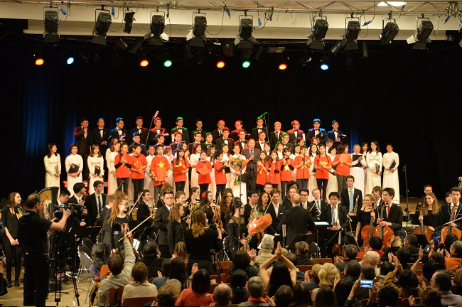
Chúc các em sức khỏe và hẹn gặp lại trong sinh hoạt năm 2017.

Thành công này thuộc về tập thể, về các em HCQH và Dàn Nhạc Giao Hưởng của Tp. Rouen. 

Tích Kỳ

Antony
05.12.2016

