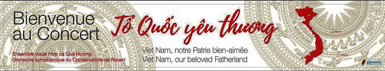

<!--
title: Lửa thử vàng, gian nan thử sức
author: TichKy Nguyen
status: completed 
--> 

 

***Gửi đến các Anh Chị các bạn gần xa***

***Các thành viên mới cũ Hợp ca Quê Hương***
 
***Nhìn lại chặng đường chúng ta đã đi qua trên chiếc "cầu khỉ" này , có thể nói rằng chúng ta đã giữ vững thăng bằng, tiếp xúc với nhiều dòng chảy văn hóa, xu hướng thẩm mỹ khác nhau của nhiều thời điểm và thế hệ. 
Chân vẫn nhịp bước trên cây cầu "kinh điển" tay giữ chắc hành trang "đam mê" và luôn hướng về dòng nhạc đã được khai sinh từ sự sống còn của quê hương đất Tổ.***
 
***Hôm nay,  đã vượt qua những khó khăn và chướng ngại của giai đoạn đầu, Hợp ca Quê Hương mạnh dạn trình làng CD đầu tay .*** 

***Tuy không dễ, nhưng chúng tôi luôn sẵn sàng bước tiếp. 
Và khiêm tốn mong chờ sự góp ý của các Anh Chị, các bạn và các anh em gần xa.***

***Hợp ca Quê Hương*** 

***Tích Kỳ***

                         _______________________________

	
Chúng tôi mới nhận được ý kiến và cảm xúc của một khán thính giả từ Việt Nam.
Xin giới thiệu sau đây Bài viết ý kiến về ***CD Tổ Quốc Yêu Thương***

                   ______________________________________________

                                     
*Thân tặng anh ***Mạnh Hà***, ***Hợp Ca Quê Hương*** và ***Dàn nhạc Giao Hưởng Nhạc Viện Rouen***

	***GIAI ĐIỆU TỔ QUỐC***
 
 "Tôi nghe giai điệu Tổ quốc tôi, 
dịu dàng trong tiếng ru hời

 Tôi nghe giai điệu Tổ quốc tôi, 
Trầm sâu trong tiếng đất trời"

Tổng phổ là dạng bản nhạc ghi cho một dàn nhạc nhiều bè với nhiều loại nhạc cụ cùng chơi. Trong nghệ thuật biểu diễn hợp xướng ở Việt Nam, phong cách biểu diễn sẽ làm nổi bật tính chất đặc trưng của bản nhạc. Thành công hay thất bại của một dàn hợp xướng trước hết thuộc về công việc giải mã tác phẩm, cách nắm bắt chính xác từng âm thanh, giai điệu, hòa âm trong tác phẩm của người chỉ huy, người sẽ làm sống lại những giá trị, nhịp điệu và sắc thái tinh tế mà nhà soạn nhạc đã sáng tạo. Chỉ huy dàn hợp xướng có trách nhiệm dẫn dắt những người mà khí chất, tính cách, giọng hát có thể khác biệt, thậm chí đối chọi nhau, thành một khối thống nhất.
Nhạc sĩ ***Đỗ Hồng Quân*** (Chủ tịch Hội Nhạc Sĩ Việt Nam) trong bài tiểu luận ***"Những vấn đề cần quan tâm về tình hình sang tác khí nhạc trong đời sống âm nhạc hiện nay”*** đã từng nhận định về tổng phổ như sau :

" Công việc sáng tác một tổng phổ âm nhạc không lời là một việc làm vô cùng vất vả, mất nhiều thời gian và công sức. Có được một tổng phổ âm nhạc, nhạc sĩ phải lao động nhiều tháng thời, có khi năm này qua năm khác. 
Như chúng ta đã biết, một tác phẩm khí nhạc dù nhỏ hay lớn muốn đến được công chúng đểu phải qua 3 giải đoạn:1. Giai đoạn sáng tạo cá nhân; 2. giai đoạn dàn dựng (thông qua tập thể nhạc công – nhạc trưởng); 3. Đưa tác phẩm tới người nghe với vai trò nghiệm thu sản phẩm, nên rất cần có sự chuẩn bị về kiến thức và những tiêu chuẩn thẩm mỹ âm nhạc tối thiểu thì công chúng mới hiểu được tác phẩm nhạc không lời.
Ba giai đoạn trên liên quan mật thiết với nhau. Thiếu một trong ba điều kiện đó, hoặc một khâu nào chuẩn bị không tốt thì không thể có được một sản phẩm âm nhạc đích thực."
Việc dàn dựng tác phẩm hợp xướng Việt Nam có nhiều vấn đề phức tạp. Các nhạc sĩ Việt Nam thường sử dụng chất liệu âm nhạc dân gian của các vùng miền. 

Chính vì vậy, khi biết được rằng người nhạc trưởng của những ca khúc hợp xướng trong ***CD Tổ Quốc Yêu Thương*** là một nhạc trưởng người Pháp tên ***Claude Brendel của Nhạc viện Rouen***, tôi không tránh khỏi bất ngờ và xúc động. 
Chắc hẳn, ông đã phải mất rất nhiều thời gian để có thể hiểu sâu sắc từ ngôn ngữ, đặc điểm giọng hát cho đến tâm sinh lý của người Việt Nam để có thể chỉ huy dàn nhạc lão luyện đến thế. Chưa kể, phải có một niềm yêu mến, tâm huyết với không chỉ đất nước Việt Nam mà còn là giai điệu của dải đất hình chữ S đến nhường nào, thì việc hợp nhất, liên kết được từng ý con người cùng hợp xướng mới nhuần nhuyễn được như vậy. 

Thông qua ***Tổ Quốc Yêu Thương***, vị nhạc trưởng tài ba này như đã làm sống lại những năm tháng hào hùng, một giai đoạn lịch sử không thể nào quên của tổ quốc ngày ấy.
Những kiến thức, kỹ năng, kỹ xảo về xử lý tác phẩm của ông, kết hợp với dàn nhạc Giao Hưởng Nhạc viện Rouen, tất nhiên không thể không kể đến linh hồn của các ca khúc, người đưa giai điệu Việt tới tay các bạn bè khắp năm châu, ***Hợp Ca Quê Hương***, tiền thân xuất phát từ một nhóm hợp xướng của cộng đồng những người Việt Nam xa xứ, lưu lạc trên đất Pháp.

Tôi vẫn còn nhớ, những buổi trưa hè nắng tháng sáu, trong khu tập thể cũ nhà ông bà ngoại, dưới bóng nắng chập chờn của giàn hoa ti- gôn đu đưa ngoài khung sắt, qua âm thanh cũ kỹ từ chiếc cát sét nhỏ màu xanh viền trắng trôi vào giấc ngủ trưa tôi bồng bềnh như những đám mây lơ lửng ngoài của sổ, giọng hát của ai như vẫn còn văng vằng bên tai, kéo tôi mơ màng vào giấc ngủ:

*" Mùa xuân đã tới, quê hương chúng tôi, 
 
Mía ngọt chè xanh, bông trắng lưng đồi, 

  Đồng xanh lúa, rập rờn biển cả, 

  Tiếng ai ru con ngủ, ru hời… "*

***Việt Nam Quê Hương Tôi (Đỗ Nhuận)***

Âm nhạc là một quá trình vận động, biến đổi không ngừng.
Tuy nhiên, giá trị "nguyên bản" lại là giá trị được nhấn mạnh xuyên suốt mạch giai điệu của ***"Tổ Quốc Yêu Thương"***. Chắc hẳn, những ai sinh từ năm 198x trở về trước còn nhớ, vào khoảng cuối những năm của thập niên 90, có một loạt các chuyên mục mang tên ***"Giai điệu Tổ Quốc"*** hay ***"Những bài ca đi cùng năm tháng"*** với những ca khúc nhạc ***Cách Mạng*** hay còn gọi là ***"Nhạc đỏ"*** mang âm hưởng dân gian thính phòng hay thính phòng cổ điển được phát đi phát lại hàng ngày, hàng tuần trên VOV của Đài Tiếng nói Việt Nam, đã trở thành món ăn tinh thần không thể thiếu trong đời sống của mỗi gia đình người Việt Nam thời bấy giờ. 

***Hợp ca Quê Hương*** được thành lập vào năm 2009 bởi cộng đồng người Việt tại Pháp, cùng với phần đệm nhạc của một dàn nhạc giao hưởng đến từ Pháp, mang trong mình ước vọng khôi phục lại nguyên gốc các tác phẩm hợp xướng kinh điển của một giai đoạn lịch sử dân tộc, và mong muốn được góp phần vào việc tôn vinh, bảo tồn và phát huy một loại hình di sản văn hóa phi vật thể vô cùng quý báu của Việt Nam. 
Không sử dụng các hiệu ứng, kỹ xảo âm thanh, cũng chẳng cần dùng đến những ca sĩ, nhạc công nổi tiếng, đắt giá trên thế giới; chỉ bằng tấm chân tình của những người con xa xứ. 

Tất cả các ca khúc của ***Tổ Quốc Yêu Thương*** đều dàn dựng từ tổng phổ nguyên gốc và được thu thanh kiểu "one-shot" (thu một lần) trực tiếp trong auditorium giống cách thu của VOV ngày xưa. Với cách làm hoài cổ này, các ca khúc trong CD mang đến cho người nghe sự rung động lan tỏa không chỉ bởi giọng hát ấm áp mà còn từ những tâm hồn tràn đầy cảm xúc.
Cùng với sự cố gắng mang đậm tính biểu tượng với sự xuất hiện của ba thế hệ người hát hợp xướng (thế hệ cao tuổi, thanh niên và thiếu nhi) trong một CD, ***"Tổ Quốc yêu thương"*** dường như đã làm sống lại những hoài niệm về một thời âm nhạc thiếu vắng đi những công nghệ hiện đại nhưng lại mang đậm những nét giản dị, mộc mạc nhưng ấn tượng khó quên của các bài hát.

*" Lòng yêu nước ban đầu là lòng yêu những vật tầm thường nhất: yêu cái cây trồng ở trước nhà, yêu cái phố nhỏ đổ ra bờ sông, yêu vị thơm chua mát của trái lê mùa thu hay mùa cỏ thảo nguyên có hơi rượu mạnh "*.

***Lòng yêu nước*** ( I-li-a Ê-ren-bua, Ngữ văn 6, tập II)
I-li-a Ê-ren-bua (1891-1967) là một nhà báo, nhà văn ưu tú; nhà hoạt động xã hội nổi tiếng của Liên Xô, sinh ra trong một gia đình Do Thái tại thành phố Ki-ép, giữa thời kỳ thử thách đầy ác liệt và cam go của đất nước Xô Viết với phát xít Hít-le trong giai đoạn chiến tranh vệ quốc (1941- 1945). Lửa thử vàng, gian nan thử sức; nhà báo I-li-a Ê-ren-bua, trong những thời khắc cam go báu và thiêng liêng nhất của lịch sử, đã ghi lại lòng yêu nước của công dân Xô Viết qua nhiều tác phẩm nổi tiếng. Trong đó không thể không kể đến tác phẩm "Thử lửa".

Tôi vẫn nhớ những buổi chiều tà những năm đầu cấp hai đi học về, bánh xe đạp Phượng Hoàng quay đều theo bóng nắng của những tán lá bàng rủ xuống dọc theo hai bên đường, vừa mải miết đạp xe tôi vừa lầm nhẩm học thuộc *“Lòng yêu nhà, yêu làng xóm, yêu miền quê trở nên lòng yêu Tổ quốc"*.

Bài văn ***“Lòng yêu nước”*** là một phần của thiên tuỳ bút vừa mang phong thái sắc sảo chính luận vừa mang đậm chất trữ tình của ***Thử lửa***. Trong ***Thử lửa***, tác giả lí giải lòng yêu bước bắt nguồn từ tình yêu với tất cả những sự vật cụ thể và bình thường nhất, gần gũi và thân thuộc nhất; đồng thời khẳng định: *Lòng yêu nước được bộc lộ đầy đủ và sâu sắc nhất trong những hoàn cảnh thử thách gay gắt của cuộc chiến tranh vệ quốc*.

*"Tổ quốc đời đời còn ghi nhớ*
*Những năm bốn mươi không bao giờ quên*
*Nam Kỳ khởi nghĩa tiếng súng Bắc Sơn
*Những tên làng, tên núi, tên sông
*Khi hát lên còn nghe vẳng đâu đây tiếng hò reo cùng tiếng súng.
*Ai biết tên các anh.*Những người chiến sĩ vô danh
*Trong những chiều hoàng hôn rực đỏ từ giã quê hương ra đi…
*Anh đã ngã xuống trong ngục tối hay trên trận tuyến
*Dưới ánh sao đêm trên đỉnh núi, hay bên bờ biển xa xôi. "*
***HỒI TƯỞNG*** (***Hoàng Vân***) (Chương 2 tổ khúc hợp xướng Tổ quốc ta)

Tôi vẫn nhớ những ngày đông tháng hai giá rét, hai bàn tay tê cóng vì lạnh, mũi sụt sịt đỏ ửng không giấu nổi run rẩy thở hắt ra đằng sau lớp khăn len và áo dạ trần bông dày sụ. Đôi chân bé nhỏ kiên nhẫn đạp lên tuyết tới giảng đường dù đã bọc hai lớp tất, một lớp ủng da bò cũng không thể xua tan nổi những giá buốt trong lòng và trong tim. Tôi biết, cách xa hàng trăm ngàn cây số nơi ***"đất nước bên bờ sóng "*** ấy, Cha Mẹ, quê hương đang mong ngóng từng ngày tôi trở về.

Tôi yêu quê hương đất nước qua lời ru của bà, qua bài giảng của thầy cô, qua những câu chuyện về Bác Hồ của ông tôi kể lại. 
Những lời dạy của Bác như còn văng vẳng đâu đây: 

*" Nước ta còn nghèo. Muốn sung sướng thì phải tự lực cánh sinh, cẩn cù lao động."
" Non sông Việt Nam có trở nên tươi đẹp hay không, dân tộc Việt Nam có sánh vai với các cường quốc năm châu được hay không đó là nhờ vào công học tập của các em."*

Có lẽ, tinh thần của vị *"Chủ tịch một nước còn nghèo, chưa có quyền hưởng thụ"*, tinh thần *“ không có việc gì khó, chỉ sợ lòng không bền”* nơi vị lãnh tụ vĩ đại của dân tộc đó đã ảnh hưởng và tác động lên tuổi thơ tôi: một người con Việt Nam sinh ra trong thời kỳ đất nước không còn vang tiếng súng, nhưng lòng vẫn run rẩy khi nghe tin ngư dân, biển đảo nước nhà đang bị đe dọa; vẫn ứa nước mắt khi thấy tivi chiếu một bài hát Việt Nam mỗi dịp Tết đến Xuân về; vẫn bực bội sửa lời những ai gọi nhầm quốc tịch, gốc gác Việt Nam cuả mình; vẫn hồ hởi vui mừng khi bắt gặp một người đồng bào nơi xứ người. 

Đồng bào, hai chữ tuy nhỏ bé mà thiêng liêng vô cùng trong lòng những người Việt xa xứ, như tấm lòng của ***Hợp Ca Quê Hương*** khi biên tập lên ***CD Tổ Quốc Yêu Thương*** này.

*" Có hai thứ chúng ta không được chọn khi sinh ra, đó là Cha Mẹ và Quê Hương. Ai cũng có một gia đình, chính gia đình là nơi mình sinh ra.
Có gia đình tràn đầy hạnh phúc, tiếng cười, nhưng cũng có gia đình lạnh giá, thậm chí cuộc sống như địa ngục. Có gia đình nghèo hèn suốt đời lam lũ, nhưng cũng có gia đình giàu sang, khi sinh ra bạn đã sống trong nhung lụa. Có gia đình bé nhỏ, thiếu tình thương, bạn sinh ra đã nhận thức được sự đói nghèo và bất hạnh. 
Quê hương cũng vậy.
Nhưng điểm chung chính là, Cha Mẹ luôn dành những điều tốt đẹp nhât cho bạn. Bạn không được chọn nơi mình sinh ra nhưng bạn được chọn cách mình sẽ sống - vậy hãy sống sao cho xứng với sự hi sinh của các bậc sinh thành.
Cũng như việc bạn đừng đòi hỏi Đất nước làm gì cho mình, hãy tự hỏi mình đã làm được gì cho Đất Nước."*

Và thế là tôi lại cắn chặt môi, hôm nay tôi bớt đi chơi một buổi để dành thêm thời gian cho học tập, nghiên cứu. Bữa ăn này tôi chừa lại vài đồng, tuy ít ỏi, nhưng góp lại vừa đủ cho một em nhỏ miền núi Tây Bắc có được manh áo ấm đón Tết. Làm thêm tôi vui vẻ gắng đứng lại vài tiếng nữa để đỡ nặng gánh Cha Mẹ nơi quê nhà. 

Niềm vui, hạnh phúc tôi chia sớt lại còn gian nan khó nhọc tôi pha nhạt đi. 

Vì tôi biết, quê hương tôi, có nhiều người nguyện cống hiến cả tuổi thanh xuân của mình xa gia đình hàng năm trời; nhiều người đã không thể có đủ thời gian chăm sóc bố mẹ già, con thơ; nhiều người đã phải dừng các kế hoạch hay buộc phải hy sinh một số ưu tiên cá nhân của mình để ra đi xây dựng Đất Nước. 

Nhiều người, cũng như tôi, như ***Hợp Ca Quê Hương***, ngày ngày thầm lặng làm những việc nhỏ bé, đơn thuần, nhưng luôn mang trong trong mình một tình yêu to lớn, với một trách nhiệm chưa từng hời hợt.

Các cường quốc khác trên Thế Giới có thể sử dụng quyền lực "cứng", thay đổi pháp luật, uy hiếp bằng sung đạn hay sử dụng ảnh hưởng từ kinh tế, chính trị để khẳng định vị thế đất nước mình. Nhưng ở Việt Nam, tôi tin, chúng ta có sức mạnh của quyền lực mềm. 

Chúng ta có một nền văn hóa lâu đời, có những ***"Thành Phố Ngàn Năm văn hiến"***(***Đoàn Bổng***), có niềm tin mãnh liệt vào những giá trị tôn giáo, tín ngưỡng đến từ Mẹ thiên nhiên, từ những vị anh hùng lịch sử có thật; có  niềm kiêu hãnh từ những di sản văn hóa cho đến những giá trị tinh thần, giá trị phi vật thể: từ câu ca, tiếng hát, từ điệu múa, vần thơ ngàn đời xưa để lại.

Khi thế giới ngày càng phát triển, xã hội ngày càng văn minh, tôi tin rằng, cuộc đấu tranh bảo vệ dân tộc của mỗi người con đất Việt chúng ta sẽ không chỉ nằm trên biên giới nơi địa đầu Tổ Quốc hay hải đảo xa xôi; không chỉ nằm trên những địa phận giao tranh hay những chiến trường khốc liệt, mà đang hiện hữu ngay trên những trang báo, qua mạng internet hay trong lời nói của mỗi con người Việt Nam, từ chính những việc nhỏ bé mà mỗi người chúng ta đang làm hàng ngày hàng giờ, thông qua chính cuộc chiến bên trong bản thân mỗi người.
 Tôi tin rằng, ở đâu đó vẫn có những ***Hợp Ca Quê Hương***, vẫn có những CD như ***Tổ Quốc Yêu Thương***; vẫn có những vần thơ, những cuốn sách, những bài hát, lời ca … dù nhỏ bé, đơn độc nhưng luôn mang trong mình một tinh thần tận tuy, can đảm và kiên trì với một tình yêu và niềm tự hào mãnh liệt trong tim.

Tôi tin rằng, cho dù có len lỏi vào mọi ngõ ngách của cuộc sống hay cạnh tranh với những tên tuổi lẫy lừng trên thế giới; dù bằng một đĩa nhạc, một tờ rơi, một món quà hay chỉ bằng một nụ cười tỏa sáng niềm tự hào dân tộc..., thì mỗi người trong chúng ta chính là cầu nối giúp bạn bè quốc tế hiểu hơn về đất nước, con người Việt Nam. 

Từ những truyền thống văn hóa, bản sắc dân tộc; những di sản phi vật thể, những giá trị tinh thần, những gì tạo nên sự khác biệt, độc đáo của Việt Nam; chúng ta sẽ góp phần kết nối và bảo vệ dân tộc trước Thế Giới, bằng chính nội lực mà chúng ta đang có.

Tôi biết, không một điều nào trong số những điều trên là dễ dàng. Nhưng, không điều gì có giá trị trong cuộc sống mà lại dễ dàng cả. Như ý nghĩa của những lời ca cuối cùng vang lên trong bài hát ***" Ca Ngợi Tổ Quốc"*** của nhạc sĩ Hoàng Vân mà tôi đã từng vinh dự được góp mặt trong bản thu đầu tiên năm ấy: ***Tương lai của chúng ta nằm trong tay của chính mỗi người***.

*"Tương lai đón chờ tay em và noi theo bước đàn anh.

 Tương lai đang đón chờ tay em đi xây dựng nước nhà."*

***Ca Ngợi Tổ Quốc***, trích đoạn dành cho thiếu nhi trong hợp xướng ***Hồi tưởng (Hoàng Vân)***

Thủy Tiên

Hà Nội, tháng 12 năm 2016
