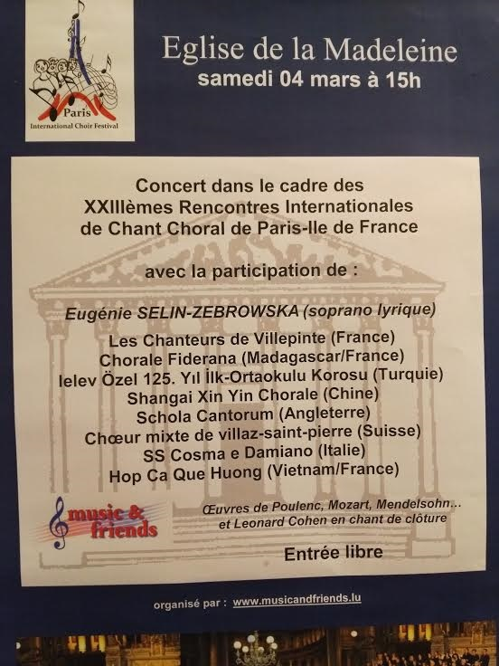
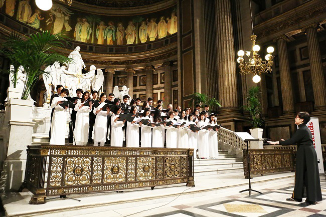
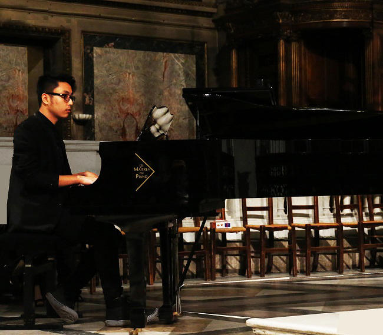
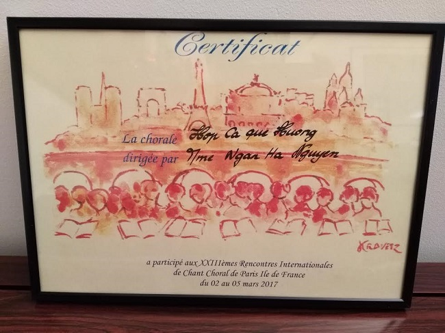

<!--
title: FESTIVAL INTERNATIONAL DE CHANT CHORAL PARIS-Ile DE FRANCE 
author: TichKy Nguyen
status: completed  
-->

     
Các em thân mến,

Trước hết chú muốn nói, tương đối với khối thời gian luyện tập cùng số lượng các em "mới toanh" trong Gia đình HCQH. Chúng ta, mạnh dạn "đem chuông đi đánh xứ người" và đã gặt hái được một thành công tương xứng rất đáng kể.

Ta không nên "tự ru ngủ" trước sự kiện thành công, phải khiêm tốn và tự thôi thúc " ngày mai HCQH sẽ phải đạt hơn hôm nay " Một thành công mà tâm điểm do sự đam mê và lòng yêu quê hương sứ sở "
HCQH đã khiêm tốn kết hợp, mạnh dạn và dung hòa giọng hát lời ca Việt bên cạnh những dàn Hợp xướng quốc tế trong lễ hội thứ XXIII Festival International de Chant Choral Paris-Ile de France, đã tạo nên một sự hòa điệu âm hưởng ấn tượng.

 

Lễ hội XXIIIème FESTIVAL INTERNATIONAL DE CHANT CHORAL PARIS-Ile DE FRANCE được tổ chức tại EGLISE DE LA MADELEINE - PARIS   ngày Thứ bảy 4.03.2017.

Có nhiều quốc gia tham dự : 
Anh / Việt Nam / Thổ Nhĩ Kỳ / Thụy Sỹ / Trung Quốc / Madagasca / Ý và Pháp nước chủ nhà.
Bà Eugénie Selin-Zebrowska soprano lyrique mở màn và được kết thúc với Hallelujah của Léonard Cohen.
Mỗi quốc gia được trình bày 2 tác phẩm, và một tác phẩm sẽ được lựa chọn trong kho tàng cổ điển thế giới.

  
 
Những tác giả cổ điển đã đươc chọn : Poulenc - Mozart - Mendelson. 
Hầu như các nước tham gia họ đều lựa chọn cho bài thứ hai, một giai điệu dân ca của quê hương họ, duy chỉ có Việt nam là cả 2 bài đều đến từ nhạc Cách Mạng.
1- Ca ngợi Tổ quốc - Hồ Bắc.
2- Việt nam quê hương tôi - Đỗ Nhuận
Phải nói là phong trào Hợp xướng toàn cầu xuất phát từ Thánh ca, nghi lễ của Giáo Đường là một dàn hợp ca với những tác phẩm có sắc thái âm hường Thánh ca. Do vậy những những tác giả, then chốt của nhiều thế hệ, luôn có ít nhiều sáng tác cho Giáo Đường và hầu hết các dàn Hợp xướng trên toàn cầu, họ luôn lựa chọn Giáo Đường làm nơi tổ chức trình diễn, phù hợp nhất cho giòng nhạc này.
Trong khi đó, Hợp xướng kinh điền của Việt nam, với giòng nhạc xuất phát từ ý tưởng đấu tranh cho độc-lập tự-do đã song hành và trường tồn với thăng trầm dân tộc, đó là nhận thức căn bản của hầu hết tác phẩm Hợp xướng Việt. HCQH muốn khiêm tốn giới thiệu đến bè bạn quốc tế khía cạnh độc đáo của văn hóa hợp xướng Việt. không phải là vì nó tuyệt đỉnh, nhưng nó là đặc trưng của nền hợp xướng còn non trẻ của Việt nam.
Vâng, chen chân vào thế giới này không phải là giản đơn.
Thành viên HCQH đến từ nhiều miền vùng xa cách, có nhiều cá tính riêng biệt, nhưng "quê hương mỗi người chỉ có một, như chỉ có một Mẹ thôi" và khi "một cây làm chẳng nên non" đoàn kết lại, thì sự thành công không còn là ảo ảnh xa vời nữa.

   
 
Rất xúc động khi biết có em không tham gia được vì tự cảm nhận hành trang còn quá "non", chỉ mới được ít buổi tập, mặc dù không thiếu nhiệt huyết. Có những em đang trong giai đoạn đấu tranh cho CDI cơm áo cũng không vắng mặt ngày trình diễn, còn có em đang trong thời gian tìm hiểu 1/2 cũng hy sinh một chiều thứ bảy đến chia sẻ cùng anh em. Có em đang trong giai đoạn nghỉ, dưỡng thai nghén cũng mày mò đến ủng hộ tinh thần, có một "anh chồng" vì quá yêu vợ, nên thương luôn HCQH và anh đã say sưa ghi hình và hứa sẽ chính thức "làm phó nháy" cho HCQH, rất cảm ơn Duy Anh.

Chao ôi, không thiếu những hành đông nâng đỡ đồng đội rất ngọt ngào.
Điều đó chứng minh, một tập thể không đoàn kết, xa quần chúng, thành công nếu có chỉ là sự hên xui.  Nhìn chung, năng nổ của những em "lính mới", xuất trận lần đầu, đã đêm ngày cố gắng "nhập tâm bài" kể cả đêm khuya vẫn điện thoại chia sẻ thắc mắc, hỏi Cô.
Chú xin nhắc, mái nhà HCQH đã trụ và không ngừng phát triển từ 7 năm nay, nhờ có sự đóng góp ***chí công vô tư*** của toàn bộ HCQH.

Cô chú rất trân trọng tinh thần trách nhiệm của các em.

Với một hành động không chuẩn bị trước nhưng đầy ý nghĩa, là sự có mặt của Đại Sứ quán Việt Nam tại Pháp - Trung Tâm Văn Hóa Việt Nam tại Pháp - phóng viên thường trực VOV.vn - thường trực Báo Nhân Dân tại Pháp và Tổ chức Franco-Vietnamienne.
Anh chị em các cơ quan nói trên có nhờ Cô chú chuyển lời ngưỡng mộ và thăm hỏi chân tình đến tập đoàn HCQH chúng ta.

HCQH rất xúc động và tự hào.
 
Thành công này thuộc về các em. Cô chú cũng được thơm lây.
Cảm ơn, đã cố gắng hết mình cho buổi trình diễn đầu mùa của năm 2017.

Chúng ta đang tiến bước trên con đường, vừa thực hiện vừa học hỏi.

Đường còn dài, còn lắm chông gai.

Hy vọng các em ý thức được điều này.

Hẹn gặp, những buổi tập sắp tới.

Tích Kỳ

05.03.2017  

 

